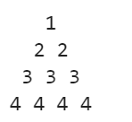
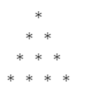
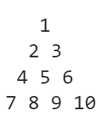
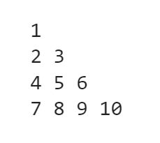
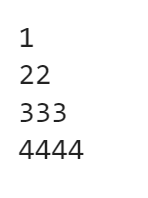
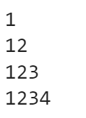
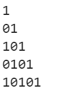
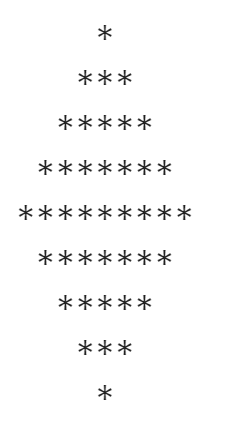
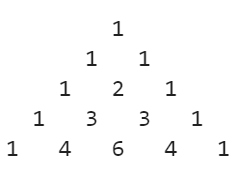
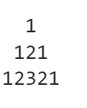

# for давталт бататгал 5

 1. Өгсөн тооны факториалыг олох програм бичнэ үү.
**Жишээ:**

&ensp; **Оролт:** 5

&ensp; **Гаралт:** 120

 2.  Гараас 1-9 хооронд тоо өгөгдөнө. Дараах байдлаар хэвлэнэ үү. 
 &ensp; **Оролт:** 4

&ensp; **Гаралт:**
 

 3. Гараас өгсөн тооны дагуу дараах байдлаар хэвлэлт хийнэ үү. 
 &ensp; **Оролт:** 4

&ensp; **Гаралт:**
 

 4. Зурагт үзүүлсэн дүрсийг давталт ашиглан хэвлэ.
 

 5. Зурагт үзүүлсэн дүрсийг давталт ашиглан хэвлэ.
 

 6. Гараас өгсөн тооны дагуу дараах байдлаар хэвлэлт хийнэ үү. 
 &ensp; **Оролт:** 4

&ensp; **Гаралт:**
 

 7. Гараас өгсөн тооны дагуу дараах байдлаар хэвлэлт хийнэ үү. 
 &ensp; **Оролт:** 4

&ensp; **Гаралт:**
 

 8. Гараас өгсөн тооны дагуу дараах байдлаар хэвлэлт хийнэ үү. 
 &ensp; **Оролт:** 5

&ensp; **Гаралт:**
 

 9. Гараас өгсөн тооны дагуу дараах байдлаар хэвлэлт хийнэ үү. Гараас өгсөн тоо нь хамгийн олон одтой мөр байна.
 &ensp; **Оролт:** 5

&ensp; **Гаралт:**
 

<!--  10.
  -->

 11. Гараас өгсөн тооны дагуу дараах байдлаар хэвлэлт хийнэ үү. 
 &ensp; **Оролт:** 3

&ensp; **Гаралт:**
 

<!-- &ensp; **Гаралт:** 
 &ensp;&ensp;&ensp;&ensp; 0 0
 &ensp; &ensp;&ensp;&ensp;1 1
 &ensp; &ensp;&ensp;&ensp;1 4
 &ensp; &ensp;&ensp;&ensp;2 2
 &ensp; &ensp;&ensp;&ensp;2 3
 &ensp; &ensp;&ensp;&ensp;3 2
 &ensp; &ensp;&ensp;&ensp;3 3
 &ensp; &ensp;&ensp;&ensp;4 1
 &ensp; &ensp;&ensp;&ensp;4 4 -->
