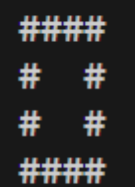

# Бататгал хичээл ба Арифметик операторууд


**Функцууд:** 
<br> Хэвлэх функц. \n -ээр шинэ мөрнөөс эхэлж болно
<br>  **printf**("Хүссэн текстээ бичээрэй\nЭнэ бол 2дахь мөр\n");

<br><br> Хувьсагчийн утга хэвлэх.
<br>  **printf**("Хувьсагчийн утга = %d\n",huvisagch); 

<br><br> Хувьсагчид гараас утга оноох
<br> 3. **scanf**("%d",&huvisagch); 

<br><br> a, b бүхэл тоон багыг буцаана
<br> 4. **min**(int a, int b) 

<br><br> a, b бүхэл тоон ихийг нь буцаана
<br> 5. **max**(int a, int b) 
<br><br><br>


<!-- </p> 4. cout<<"Хүссэн текстээ бичээрэй" << huvisagch<<"\n";
</p> 5. cin >> huvisagch<<"\n";
<br><br><br> -->

**Арифметик операторууд:** 
</p>+ (Нэмэх үйлдэл)
</p>- (Хасах үйлдэл)
</p>* (Үржих үйлдэл) 
</p>/ (Хуваах үйлдэл - Бүхэл хэсэг) ------ Жишээ нь: 8/3 = 2
</p>% (Хуваах үйлдэл - Үлдэгдэл хэсэг) ------ Жишээ нь: 18%5 = 3

### Жишээ
```c
int main() {
    // printf("Hello World!\n");
    // printf("1st line\n 2nd line\n 3rd line\n");

    // int a=0;
    // a=21;
    // printf("a = %d\n",a);

    // printf("a -d utga oruulna uu:\n");
    // scanf("%d",&a);
    // printf("a = %d\n",a);

    int a1,a2;
    scanf("%d",&a1);
    scanf("%d",&a2);
    int ih = max(a1,a2);
    int baga = min(a1,a2);
    printf("max value = %d\n",ih);
    printf("min value = %d\n",baga);
    return 0;
}
```

### Жишээ
```c
int main() {
    int a,b;
    a=18;
    b=10;

    int nemeh;
    int hasah;
    int urjih;
    int huvaah_buhel;
    int huvaah_uldeg;

    nemeh = a+b;
    hasah = a-b;
    urjih = a*b;
    huvaah_buhel = a/b;
    huvaah_uldeg = a%b;

    printf("a+b = %d\n",nemeh); //28 гарна
    printf("a-b = %d\n",hasah); //8 гарна
    printf("a*b = %d\n",urjih); //180 гарна
    printf("a/b = %d\n",huvaah_buhel); //1 гарна
    printf("a%b = %d\n",huvaah_uldeg); //8 гарна

    return 0;
}
```


## Дасгал ажлууд ##
<br>1. "Сайн байна уу? Си хэл" гэдэг үгийг хэвлэн харуул.
<br>2. y, m, d хувьсагчдад 2023,9,7 гэдэг утгуудыг оноож "Өнөөдөр %d оны %d сарын %d-ны өдөр" гэсэн форматаар хэвлэн харуул.
<br>3. Он, сар, өдрийг гараас авч дээрхийн адил хэвлэн харуул. 
<br>4. Зурагт үзүүлсэн дүрсийг хэвлэнэ үү. 
<br>
<br>5. a, b хоёр тоог гараас авч тэдгээрийн хооронд +,-,*,/,% үйлдлүүдийг хийж хэвлэн харуул. 
<br>6. Гараас өгсөн 2 тооны ихийг олж хэвлэх програм зохионо уу.
<br>7. Гараас өгсөн 3 тооны хамгийн ихийг олж хэвлэх програм зохионо уу.
<br>8. Гараас өгөгдсөн 3 тооны хамгийн багыг олж хэвлэх програм зохионо уу.
<br>9. Дараах холбоосоор нэвтэрч эхний 10 бодлогыг бодно уу. [SPOJ.com/HOME/](https://www.spoj.com/HOME/problems/main/) 
