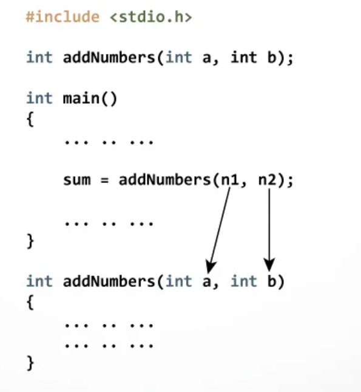

# Хэрэглэгчийн функц
Тодорхой даалгавар гүйцэтгэх зорилготой нэгж болгон эмхэтгэсэн командуудын дарааллыг функц гэдэг.

## Функц зарлах ##
Тухайн функцийг ашиглахаас өмнө түүнийг зарласан байх хэрэгтэй. Функцүүд **main** функцийн өмнө дуудагдах дарааллын дагуу зарлагдсан байх хэрэгтэй. 
<br>**Дүрэм:** 
```c
буцаах_төрөл нэр(төрөл p1, төрөл p2, ...);
```
| Функцийн хэсгүүд | Тайлбар                                                                                  |
| ---------------- | ---------------------------------------------------------------------------------------- |
| **буцаах_төрөл** | `return` ашиглаж буцаах хувьсагчийн төрөл. Хэрэв утга буцаахгүй бол `void` -г ашигладаг. |
| **нэр**          | Тухайн функцийн нэр. Функцийг дуудахад хэрэглэнэ.                                        |
| **p1,2...**      | Параметр буюу тухайн функц руу дамжуулж буй утгууд.                                      |
| **төрөл**        | Параметрийн хувьсагчийн төрөл.                                                           |

Функцийг зарлахад зөвхөн параметрийн төрлийг нь тавьж, нэрийг нь тавихгүй байж болдог.
#### Жишээ: Функц зарлах ####
```c
void print(int);
```

## Функц тодорхойлох ##
Функцийг тодорхойлоход түүний `буцаах утга, нэр, параметрүүдийн тоо яг таарч` байх ёстой. Тодорхойлолтод параметрүүдийн нэрийг заавал зарлаж өгнө. Хэрэв функцийг `main-с` өмнө тодорхойлж байвал түүнийг `зарлахгүй` байж болно.

<br>**Дүрэм:** 
```c
буцаах_төрөл нэр(төрөл p1, төрөл p2, ...){
    //Функцийн гүйцэтгэх үйлдлүүд
    //...
}
```
Энд төрөл төрлийн p1 (гэх мэт) хувьсагч зарлаад түүнд дамжуулсан утгыг `хадгалж` өгдөг. Энэ хувьсагчууд нь функц ажиллаж эхлэхэд зарлагдаад ажиллаж дуусмагц санах ойгоос `чөлөөлөгддөг`(Устгагддаг).

#### Жишээ: Бүхэл тоо хэвлэх ####
```c

void print(int number){
    printf("%d\n",number);
}

```
Утга буцаахдаа `return` түлхүүр үгийг ашиглаж буцаах утгыг эсвэл илрхийлэл бичиж түүний үр дүнг буцаадаг. 

#### Жишээ: Тоог нэмэгдүүлж буцаах ####
```c

int inc1(int number){
    number++;
    return number;
}

```
****

## Функцийг хэрэглэх ##
Функцийг хэрэглэхдээ тухайн функцийг нэрээр нь дуудаж өгнө. Хэрэв тухайн функц параметртэй бол `параметрүүдэд` нь тохирсон `утгыг дарааллаар` нь бичиж өгнө. Хэрэв тухайн функц `утга буцаадаг` бол буцаасан утгыг нь `утга оноох` оператор ашиглаж хувьсагчид хадгална.

<br>**Дүрэм:** 
```c

Хувьсагч = функцийн_нэр(утга1, утга2, ...);

```
<br>

#### Жишээ: Тоог нэгээр нэмж хэвлэх ####
```c

int inc1(int number);
void print(int number)

int main(){
    int a=9; 
    int b = inc1(a);
    print(b);
    return 0;
}

int inc1(int number){
    return ++number;
}
void print(int number){
    printf("%d\n",number);
}
```

## Функцэд reference ашиглах ##
Reference гэдэг нь хувьсагчийн өөр нэг нэр гэж ойлгож болно. Reference -ийг зарлахдаа `&` -ийг ашиглана. Жишээ нь: 

Дараах жишээнд байгаа A хувьсагч мөн B гэсэн нэртэй болсон. Тиймд A-г өөрчлөөд B -г хэвлэвэл A-ийн өөрчлөгдсөн утга хэвлэгдэнэ.
```c
void main(){
    int A=10;
    int &B = A;
    A++;
    cout<<B; // 11 гэж хэвлэгдэнэ.
}
```

`Параметр` болгож дамжуулсан хувьсагчийн утгыг `өөрчлөхийн` тулд `reference` ашигладаг. Дамжуулсан параметрийн утгыг нэгээр нэмэгдүүлэх жишээг үзүүлэв.
```c
void incOne(int &a){
    a++;
}
void main(){
    int A=1;
    incOne(A);
    cout<<A; // 2 гэж хэвлэгдэнэ.
}
```


## Дасгал ажлууд ##
<br>1. Өөрийн нэрийг хэвлэдэг функц бичиж ажиллуулна уу.
<br>2. Өгсөн 2 тооны нийлбэрийг бодож буцаадаг функц бичнэ үү.
<br>3. 3 тооны ихийг олж буцаадаг функц бичиж шалгана уу.
<br>4. Өгсөн тооны факториалыг тооцож буцаадаг функц бичиж шалгана уу.
<br>5. 3 тооны дунджийг буцаах функц бичиж шалгана уу.
<br>6. Гараас өгсөн n тоо анхны тоо бол 1 үгүй бол 0 буцаадаг функц бичнэ үү. 
<br>7. Өмнөх дасгалыг үргэлжлүүлэн гараас өгсөн n тоо хүртэлх
бүх анхны тоонуудыг хэвлэдэг програм бичнэ үү.  

`Reference ашиглах дасгалууд:`
<br>1. Тоог абсолют утга руу нь шилжүүлнэ. Тухайн тоо эерэг тоо бол хэвээр нь үлдээж, сөрөг тоо бол эерэг тэмдэгтэй болгоно. Энэ функц нь утга буцаахгүй.
<br>2. Хувьсагчийн утгыг нэгээр нэмэгдүүлэх функц бичнэ үү. Энэ функц нь утга буцаахгүй.
<br>3. 2 хувьсагчийн утгыг солих функц бичнэ үү. Энэ функц нь утга буцаахгүй. 


<br>8. Хамгийн их ерөнхий хуваагчийг Евклидийн алгоритмаар бодох функц бичиж шалгана уу. 

```
*Евклидийн алгоритм гэдэг нь 2 натурал тооны хамгийн их ерөнхий хуваагчийг олох аргуудын нэг юм. 2 бодит тоо a, b-гийн хувьд a-г b-д хуваахад гарах үлдэгдлийг r гэвэл a ба b-гийн хамгийн их ерөнхий хуваагч нь b ба r-ийн хамгийн их ерөнхий хуваагчтай тэнцүү байдаг.*
```

****


<!-- Recursive functions coming soon -->

