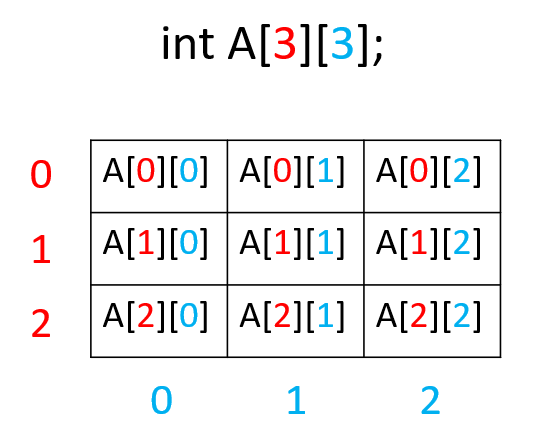

# Хоёр хэмжээст хүснэгт

2x3 хэмжээтэй хоёр хэмжээст array зарлаж элементүүдийг гараас уншъя.
<br>
```c
int main(){
  int A[2][3];
  //Garaas utga unshih
  for(int i=0;i<2;i++){ //Mur
    for(int j=0;j<3;j++){ //Bagana
      cin>>A[i][j];
    }
  }
  //2D husnegtiig hevleh
  for(int i=0;i<2;i++){ //Mur
    for(int j=0;j<3;j++){ //Bagana
      cout<<A[i][j]<<" ";
    }
    cout<<'\n';
  }
  return 0;
}
```

3x3 хэмжээтэй 2 хэмжээст array зарлая.
<br>

2 хэмжээст array-д анхны утга оноохдоо мөр мөрөөр нь багцлан оноодог.
```c
int main(){
  int A[3][3] = {{0,1,2},{3,4,5},{6,7,8}}; //Ahnii utga
  for(int i=0;i<3;i++){ //Mur
    for(int j=0;j<3;j++){ //Bagana
      cout<<A[i][j]<<" ";
    }
    cout<<'\n';
  }
  return 0;
}
```

## Дасгал ажлууд ##

<br>1. 3x4 хэмжээтэй 2 хэмжээст хүснэгт зарлаж. Бүх элементэд 10 утга оноож хэвлэ.

<br>2. 3x4 хэмжээтэй 2 хэмжээст хүснэгт зарлаж. Элементүүдийг гараас уншиж хүснэгтийг хэвлэ.

<br>3. 4x4 хэмжээтэй 2 хэмжээст хүснэгт зарлаж. Тэгш индекстэй мөрүүдийн нийт элементүүдийн нийлбэрийг олж хэвлэ.

<br/> 12 12 12 12
<br/> 22 22 22 22
<br/> 33 33 33 33
<br/> 55 55 55 55

<br> 180

<br>4. 4x4 хэмжээтэй 2 хэмжээст хүснэгт зарлаж элементүүдийг гараас авна. Зүүн дээд булангаас баруун доод булан хүртэлх диагональ дээрх элементүүдийн нийлбэрийг хэвлэ.

<br/> 12 12 12 12
<br/> 22 22 22 22
<br/> 33 33 33 33
<br/> 55 55 55 55

<br> 122

<br>5. 4x4 хэмжээтэй 2 хэмжээст хүснэгт зарлаж элементүүдийг гараас авна. Тухайн мөр дэх тэгш тоонуудыг хэвлэ.

<br/> 12 11 2  5
<br/> 22 22 22 22
<br/> 33 33 33 33
<br/> 55 55 50 54

<br>


<br/>12 2
<br/>22 22 22 22
<br/>
<br/>50 54

<br>6. 3x3 хэмжээтэй 2 хүснэгт гараас өгөгдөнө. 2 хүснэгтийн ижил мөр, баганад байгаа элементүүдийг нэмж хэвлэ.

<br/> 1 2 3 
<br/> 4 5 6
<br/> 7 8 9

<br/> 10 12 13 
<br/> 11 10 19
<br/> 13 18 10
<br>

<br/> 11 14 16 
<br/> 15 15 25
<br/> 20 26 19

<br>7. Эхлээд n тоо өгөгдөнө. Дараа нь nxn хэмжээтэй хүснэгт гараас өгөгдөнө. Диагоналиор хувааж дээд талыг хэвлэ.
<br/> 5
<br/> 2 3 1 5 0
<br/> 7 1 5 3 1
<br/> 2 5 7 8 1
<br/> 0 1 5 0 1
<br/> 3 4 9 1 5                                        
<br>
<br/> 2 3 1 5 0
<br/>&ensp;   1 5 3 1
<br/>&ensp; &ensp;     7 8 1
<br/>&emsp;&emsp;       0 1
<br/>&ensp;&ensp;&ensp;&ensp;&nbsp;&nbsp;&nbsp;      5   