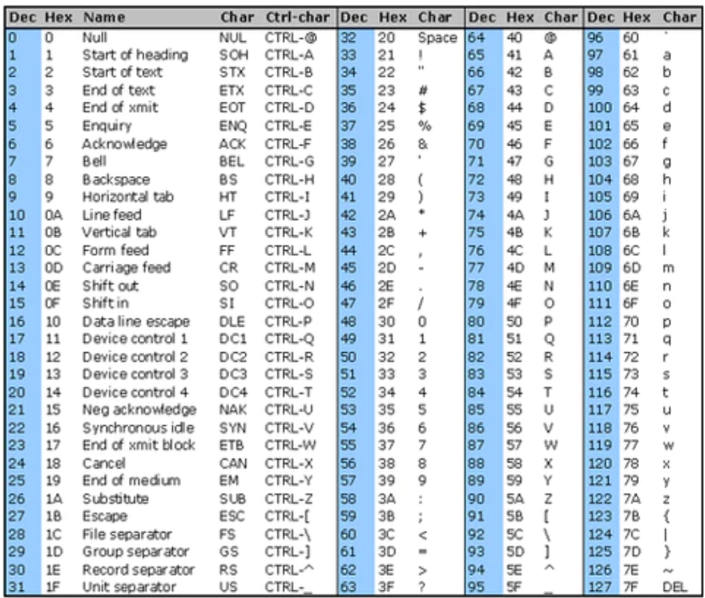

# Тэмдэгт(character)

Бүхэл тоо, бутархай тоон адил тэмдэгт бол хувьсагчийн төрөл юм. 

char 1 Byte хэмжээтэй. 
```c
char A = 'C'; 
cout<<A; // C 
```

ASCII код:

0-127 хүртэлх кодууд байна. Код тус бүр нь нэг тэмдэгтийг илэрхийлнэ. 

ASCII утга ‘a’ - ‘z’ =  97-122

ASCII утга ‘A’ - ‘Z’ =  65-90

ASCII утга ‘0’ - ‘9’ = 48-57 


ASCII хүснэгт: 
<br>


### Тэмдэгтийг ASCII утга руу хөрвүүлэх
```c
int main(){
  char c = 'A';
  cout << "'A'-н ASCII утга: ";
  cout << int(c);
  return 0;
}
```
### ASCII утгыг тэмдэгт рүү хөрвүүлэх
```c
int main(){
  int x = 65;
  cout << "ASCII утга 65-н тэмдэгт: ";
  cout << char(x);
  return 0;
}
```

## Тэмдэгтэн хүснэгт
Тэмдэгтээс бүрдсэн хүснэгтэд үг хадгалах боломжтой. Хүснэгтийн ард заавал `төгсгөгч тэмдэгт ( '\0' )` орох ёстой. Тиймээс хүснэгтийн хэмжээ үгийн хэмжээнээсээ `дор хаяж нэгээр` илүү байх ёстой. 

**жишээ:** 
<br>

```c
int main(){
  char A[6] = "Hello";
  cout << A;
  return 0;
}
```

## 2 хэмжээст тэмдэгтэн хүснэгт
Дараах жишээг зурагт үзүүлэв.
```c
int main(){
  char A[5][10]={"Hello", "Itisme", "Darkhan", "Nand", "Amjilt"};
  for(int i=0;i<5;i++){
    cout<<A[i]<<'\n';
  }
  return 0;
}
```
<br>


## Дасгал ажлууд ##

<br>1. 0-127 хүртэлх ASCII кодод харгалзах тэмдэгтүүдийг давталтаар хэвлэ.
<br>жишээ: ...
<br> 65 A
<br> 66 B 
<br> 67 C  ...

<br>2. Гараас 1 тэмдэгт өгөгдөнө. Тухайн тэмдэгт үсэг бол 1, тоо бол 2, бусад төрлийн тэмдэгт бол 3 -г хэвлэ.
<br>жишээ: ...
<br> A
<br> 1

<br> b
<br> 1

<br> 0
<br> 2

<br> +
<br> 3

<br>3. Гараас 1 үг өгнө. Тухайн үг хэдэн үсэгнээс бүрдсэнийг тодорхойл.
<br>жишээ: ...
<br> Hello
<br> 5

<br> WeAreAsian
<br> 10

<br>4. Гараас n тоо өгөгдөнө. Үүний дараа n ширхэг англи цагаан толгойн үсгээс бүрдсэн үг өгөгдөнө. Үгийн том үсгийг жижиг, жижиг үсгийг том болгон хэвлэ.
<br>жишээ: ...
<br> 5
<br> APPle
<br> appLE

<br>5. Гараас n тоо өгөгдөнө. Үүний дараа n ширхэг англи цагаан толгойн үсгээс бүрдсэн үг өгөгдөнө. Тус үг палиндром бол Yes үгүй бол No гэж хэвлэ. (Урд болон ардаасаа ижил уншигддаг үгийг палиндром гэнэ)
<br>жишээ: ...
<br> 5
<br> Hello
<br> No

<br> 10
<br> HelloolleH
<br> Yes

<br>6. Эхлээд n тоо өгнө. Гараас өгсөн n ширхэг үгнүүдийг өгсөн дарааллаар хэвлэ.
<br>жишээ: ...
<br/> 3
<br/> Hi
<br/> Hello
<br/> World

<br/> Hi
<br/> Hello
<br/> World

<br>7. Эхлээд n тоо өгнө. Гараас өгсөн n ширхэг үгнүүдийг өгсөн дарааллын эсрэгээр хэвлэ.
<br>жишээ: ...
<br/> 3
<br/> Hi
<br/> Hello
<br/> World

<br/> World
<br/> Hello
<br/> Hi