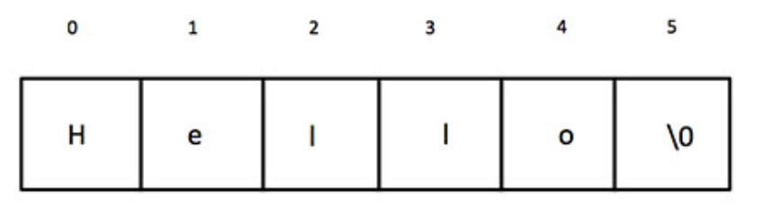
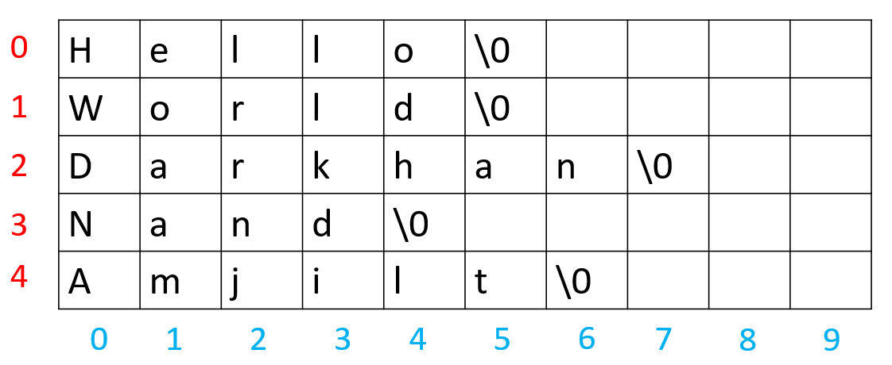

# Тэмдэгт(character)

Бүхэл тоо, бутархай тоон адил тэмдэгт бол хувьсагчийн төрөл юм. 

char 1 Byte хэмжээтэй. 
```cpp
char A = 'C'; 
cout<<A; // C 
```
<br>
'a'- үсэг тэмдэглэхэд '-г ашиглана.<br>
"a" - үг тэмдэглэхэд ашиглана.
дээрхи 2 нь адилхан юм шиг харагдаж байгаа ч, C++ хэл дээр ялгаатай.
Эхнийх нь a үсэг, дараахь нь а гэдэг үг.
<br>
'ab'- гэж болохгүй(ийм үсэг байхгүй тул)<br>
"ab" - ab гэсэн үг тул асуудалгүй.
<br>

# ASCII код:

C++ хэл дээр үсэгнүүдийг тоо болгож хадгалдаг. Хувьсагчийн төрлөөс нь хамаараад тоог нь хэвлэх үү, үсгийг нь хэвлэх үү гэдгээ шийдэж байгаа.

Доорхи кодыг ажиллуулаад үзнэ үү.
```cpp
char a = 65;
int b = 65;
cout<<a<<"\n";
cout<<b<<"\n";
```

Ямар тоо нь ямар үсэг(мөн тэмдэгт)-ийг илэрхийлэх вэ гэдгийг ASCII дээр тодорхойлсон байдаг.

ASCII хүснэгт: 
<br>

### Тэмдэгтийг ASCII утга руу хөрвүүлэх
```cpp
int main(){
  char c = 'A';
  cout << "A usegnii utga ni : ";
  cout << (int)c;
  return 0;
}
```
<br>
### ASCII утгыг тэмдэгт рүү хөрвүүлэх
```cpp
int main(){
  int x = 65;
  cout << "ASCII utga 65-iin temdegt: ";
  cout << (char)x;
  return 0;
}
```
<br>
## Тэмдэгтэн хүснэгт
Тэмдэгтээс бүрдсэн хүснэгтэд үг хадгалах боломжтой. Хүснэгтийн ард заавал `төгсгөгч тэмдэгт ( '\0' )` орох ёстой. Тиймээс хүснэгтийн хэмжээ үгийн хэмжээнээсээ `дор хаяж нэгээр` илүү байх ёстой. 

**жишээ:** 
<br>

```cpp
int main(){
  char A[6] = "Hello";
  cout << A;
  return 0;
}
```

## 2 хэмжээст тэмдэгтэн хүснэгт
Дараах жишээг зурагт үзүүлэв.
```cpp
int main(){
  char A[5][10]={"Hello", "Itisme", "Darkhan", "Nand", "Amjilt"};
  for(int i=0;i<5;i++){
    cout<<A[i]<<'\n';
  }
  return 0;
}
```
<br>

# string
string нь char-ийн array(нарийн хэлбэл vector) л гэсэн үг. vector-ийн фунцуудыг бүгдийг нь ашиглаж болно.

```cpp
string s,t="amarhan baigaa biz dee";
cout<<t<<"\n";
cin>>s;
cout<<s;
```

| код | тайлбар |
| --- | --- |
| string s; | string төрлийн s хувьсагч зарлах |
| cin>>s; | гараас string төрлийн хувьсагч унших(space эсвэл enter болтолхи үгийг уншина) |
| cout<<s; | string төрлийн хувьсагчыг хэвлэх |
| s.push_back('a'); | a үсэг ард нь нэмнэ |
| s.pop_back(); | хамгийн арын үсгийг нь устгана. |
| string a = "hello";<br>string b=" world";<br>string c = a+b; | string-үүдийг залгаж болдог.O(size) |
| s.substr(start,size); | s-ийн start индексээс эхлэн size хэмжээтэй string-ийг буцаана. |
| s[i] | s-ийн (i+1) дэх үсэг рүү хандах |

```cpp
string s = "xello";
cout<<s<<"\n";

s[0] = 'h';

cout<<s<<"\n";

cout<<s.size()<<"\n";

s.push_back(' ');
char b = 'A';
s.push_back(b);

cout<<s<<"\n";

for(int i=0;i<s.size();i++){
  cout<<s[i]<<" ";
}
```


## Дасгал ажлууд ##

<br>1. ASCII table ашиглаад, " болон '-г ашиглахгүйгээр NAND гэж хэвлэ.

<br>2. Гараас 1 тэмдэгт өгөгдөнө. Тухайн тэмдэгт үсэг бол 1, тоо бол 2, бусад төрлийн тэмдэгт бол 3 -г хэвлэ.
<br>жишээ: ...
<br> A
<br> 1

<br> b
<br> 1

<br> 0
<br> 2

<br> +
<br> 3

<br>3. Гараас 1 үг өгнө. Тухайн үг хэдэн үсэгнээс бүрдсэнийг тодорхойл.
<br>жишээ: ...
<br> Hello
<br> 5

<br> PhysicalAsia
<br> 12

<br>4. Гараас n тоо өгөгдөнө. Үүний дараа n ширхэг англи цагаан толгойн үсгээс бүрдсэн үг өгөгдөнө. Үгийн том үсгийг жижиг, жижиг үсгийг том болгон хэвлэ.
<br>жишээ: ...
<br> 5
<br> APPle
<br> appLE

<br>5. Гараас n тоо өгөгдөнө. Үүний дараа n ширхэг англи цагаан толгойн үсгээс бүрдсэн үг өгөгдөнө. Тус үг палиндром бол Yes үгүй бол No гэж хэвлэ. (Урд болон ардаасаа ижил уншигддаг үгийг палиндром гэнэ)
<br>жишээ: ...
<br> 5
<br> Hello
<br> No

<br> 10
<br> HelloolleH
<br> Yes

<br>6. Эхлээд n тоо өгнө. Гараас өгсөн n ширхэг үгнүүдийг өгсөн дарааллаар хэвлэ.
<br>жишээ: ...
<br/> 3
<br/> Hi
<br/> Hello
<br/> World

<br/> Hi
<br/> Hello
<br/> World

<br>7. Эхлээд n тоо өгнө. Гараас өгсөн n ширхэг үгнүүдийг өгсөн дарааллын эсрэгээр хэвлэ.
<br>жишээ: ...
<br/> 3
<br/> Hi
<br/> Hello
<br/> World

<br/> World
<br/> Hello
<br/> Hi

<br>8. 10000 хүртэлхи оронтой тоо өгөгдөнө. Уг тоог 9-д хуваахад гарах үлдэгдлийг ол.
<br>жишээ: ...
<br/> 1234567891234567891234567894
<br/> 4

<br>9. SPOJ.com/RGB7-оос доорхи бодлогуудыг бодно уу.
RGB7062 ~ RGB7580


