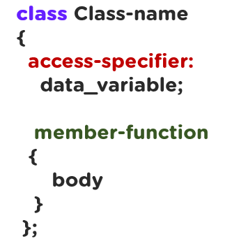
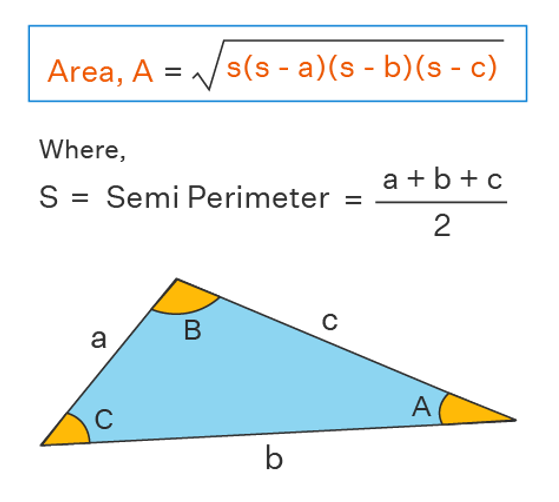

# Класс ба объект

- Класс нь үүсмэл буюу програмчийн тодорхойлсон өгөгдлийн төрөл юм. Объект бол тэр төрлийн жишээ юм. Өөрөөр хэлбэл тухайн класс төрлийн хувьсагчийг объект гэж ойлгож болно. 
 
 *Жишээ нь: Хүн гэдэг класс байлаа гэж бодвол Сайхнаа гэдэг нь хүн гэдэг классын жишээ буюу объект болно.*


- Класс нь хувьсагч болон функцүүдийг агуулдаг. Тэднийг харгалзан гишүүн өгөгдөл, гишүүн функц гэж нэрлэдэг. 


- Гишүүн өгөгдөл ба функцүүд `public`, `private` эсвэл `protected` хандалтын түвшинтэй байдаг. Эдгээр нь тухайн гишүүдийн scope буюу хамрах хүрээг тодорхойлдог. 


- `public` гишүүд рүү класс дотроос, мөн классын гаднаас хандаж болдог. Бид энэ удаад зөвхөн `public` гишүүдтэй жишээ дээр ажиллана.

Обьектын гишүүн өгөгдөл болон функцэд хандахын тулд шууд хандалтын оператор буюу .(цэгийг) ашиглана.  

## Классын жишээ
Дөрвөлжин буюу Rectangle гэдэг класс зохиоё. Энэ классын гишүүн өгөгдлүүд нь дөрвөлжний өндөр ба өргөн байна. Мөн дөрвөлжний талбай ба хүрээний уртыг олдог функцүүдийг мөн тодорхойлъё.

*Класс зарлах дүрэм*
<br>

``` c++
class Rectangle
{
//Хандалтын түвшин
public:
//Гишүүн өгөгдлүүд
  double width;
  double height;

//Гишүүн функцууд
  double calculateArea()
  {
    return width * height;
  }

  double calculatePerimeter()
  {
    return 2 * (width + height);
  }
};

int main()
{
  Rectangle M;
  cin >> M.height;
  cin >> M.width;
  cout << M.calculateArea()<<endl;
  cout << M.calculatePerimeter()<<endl;
  return 0;
}
```

## Дасгал ажлууд ##

<br>1. Cicle буюу тойрог гэдэг класс зохиож шалгана. Энэ класс нь радиусыг илэрхийлэх нэг гишүүн өгөгдөлтэй байна. Тойргийн урт болон талбайг олдог гишүүн функцүүдтэй байна.


<br>2. Triangle буюу гурвалжин гэдэг класс зохиож шалгана. Энэ класс нь 3 талын уртыг илэрхийлэх a,b,c гишүүн өгөгдөлтэй байна. Гурвалжны периметр болон талбайг олох гишүүн функцүүдтэй байх ёстой. Үр дүнг тасаллаас хойш 3 ороны нарийвчлалтай хэвлэ.

*Дараах зурагт тайлбарласнаар гурвалжны 3 талыг ашиглаад түүний талбайг олж болно.*
<br>

<br>3. Person буюу хүн гэдэг класс зохиож шалгана. Энэ класс нь хүний нэр, төрсөн он сар өдөр, хүйс, утасны дугаар гэсэн гишүүн өгөгдөлтэй байна. Гишүүн функцүүдэд: Бүх гишүүн өгөгдлүүдийг хэвлэдэг функц, нэрийнх нь үсгийн тоог хэвлэдэг функц, мөн ирээдүйн он гараас уншиж аваад тухайн онд хэдэн настай байхыг нь олдог функцүүдтэй байх ёстой. Өөрийн жишээг үүсгэж шалгана уу.

<br>4. https://kenkoooo.com/atcoder/#/contest/show/3cef52ea-e433-49c0-b319-c523c46886b4 