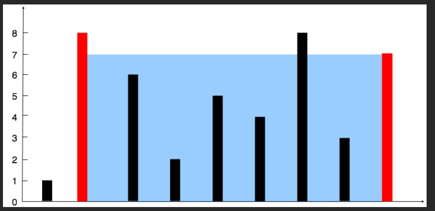

# vector

- Vector бол динамик array-ын класс юм. Статик array -н зарласан хэмжээг өөрчлөх боломжгүй байдаг бол динамик array -д шинэ элемент нэмэх хасах үед хэмжээгээ өөрчилж байдаг. 
  

*Дараах тайлбаруудад vector-ийг v-ээр , int -ийг k -ээр илэрхийлэв. Энэ удаад зөвхөн бүхэл тоон векторын үзнэ.* 

**Векторыг зарлах:**
``` c++
int main(){
   vector<int> v1;
   vector<int> v2(10);
}
```


<br> vector классын **гишүүн функцүүдийг** авч үзье:

<br/>

**Vector-н элементүүд рүү хандах:** 

| Function|  Тайлбар  |
|------|-------| 
| v[k] |  k индекс дээрх элемент рүү хандах |
| cin>>v[i] |  i индекс дээр гараас утга хадгалах|
| cout<<v[i] |  i индекс дээрх элементийг хэвлэх |
|v.front()| vector-н эхний элементийг буцаана |
|v.back()|  vector-н сүүлийн элементийг буцаана |


<br/>

**Хэмжээтэй холбоотой функцүүд:**

| Функцүүд | Тайлбар|
|-----|-----|
|v.size()| элементийн тоог буцаана |
|v.empty()| vector хоосон бол 1 үгүй бол 0 буцаана|

**Өөрчлөгч функцууд:**

| Функцүүд | Тайлбар|
|-----|-----|
|v.clear()| Бүх элементийг устгана |
| v.push_back(k)|  vector-н ард k элементийг нэмнэ |
| v.pop_back()  |  vector-н арын элементийг устгах|
|v.erase(v.begin()+k)| k индекс дээрх элементийг усгах. |

`erase()` функц нь iterator буюу элементийн хаягийг параметр болгож авдаг. `v.begin()` бол хамгийн эхний элементийн хаяг юм. Түүн дээр k -г нэмбэл k индекс дээрх элементийн хаяг болно.
``` c++
int main(){
   vector<int> v={1,2,4,5,6};
   v.erase(v.begin()+0);
   //v = {2,4,5,6}
}
```

**Харьцуулах үйлдлүүд**

| Функцүүд | Тайлбар|
|-----|-----|
|==| Тухайн 2 vector-н бүх харгалзах элементүүд тэнцүү эсэхийг шалгана |
|>|  Толь бичгийн дарааллаар харьцуулна |
|<|  Толь бичгийн дарааллаар харьцуулна |

*Толь бичгийн дарааллын жишээ:  {1,1,1,`2`,34,5} < {1,1,1,`3`,5,1}*


``` c++
int main() {
  vector<int> v1(5); //5 хэмжээтэй зарлах
  vector<int> v2 = {1, 2, 3, 4, 5};
  for(int i=0;i<5;i++){
    cin>>v1[i];
  }
  cout<<"v1: ";
  for(int i=0;i<v1.size();i++) cout<<v1[i]<<" ";
  cout<<endl;

  cout<<"v2: ";
  for(int i=0;i<v2.size();i++) cout<<v2[i]<<" ";
  cout<<endl;

   //2 vector-оо харьцуулъя
   if(v1==v2){
      cout<<"v1==v2"<<endl;
   }else if(v1>v2){
      cout<<"v1>v2"<<endl;
   }else{
      cout<<"v1<v2"<<endl;
   }
   
   cout<<"Та гараас 3 утга v1 -рүү нэмнэ үү: ";
   for(int i=0; i<3;i++){
      int temp; cin>>temp;
      v1.push_back(temp);
   }
   cout<<"Шинэчилсэн v1: ";
   for(int i=0; i<v1.size();i++)cout<<v1[i]<<" ";
   cout<<endl;

   v1.pop_back();
   v1.pop_back();
   cout<<"Хоёр удаа pop_back() хийсний дараа v1: ";
   
   for(int i=0; i<v1.size();i++) cout<<v1[i]<<" ";
   cout<<endl;

   v1.erase(v1.begin()+2);
   cout<<"Хоёр индекс дээрх элементийг устгасан v1: ";
   
   for(int i=0; i<v1.size();i++) cout<<v1[i]<<" ";
   cout<<endl;

   v1.clear();
   cout<<"Clear хийсний дараа v1: ";
   
   for(int i=0; i<v1.size();i++) cout<<v1[i]<<" ";
   cout<<endl;

   if(v1.empty()){
      cout<<"v1 is empty!\n";
   }else{
      cout<<"v1 is not empty!\n";
   }
  return 0;
}
```

## Бие даах бодлогууд

<br/>1. Гараас n тоо ба n ширхэг бүхэл тоо өгөгдөнө. Векторт хадгалж хамгийн их болон бага утгуудыг хэвлэ.

<br/> 8
<br/> 12 12 12 3 45 6 7 2
<br/> 45 2

<br/>2. Гараас n тоо ба n ширхэг бүхэл тоо өгөгдөнө. Векторт хадгалж векторийн сүүлийн элементэд хуваагддаг тоонуудын тоог ол.

<br/> 8
<br/> 12 12 12 3 45 6 7 2 
<br/> 5

<br/>3. Гараас n тоо ба n ширхэг бүхэл тоо өгөгдөнө. n дэх элемент нийт хэдэн удаа давтагдаж байгааг ол.

<br/> 10
<br/> 12 5 5 3 45 6 7 5 3 5
<br/> 4

<br/>4. Гараас n тоо ба n ширхэг бүхэл тоо өгөгдөнө. Векторт хадгалж элементүүдийн давхардлыг арилга.

<br/> 10
<br/> 12 5 5 3 45 6 7 5 3 5
<br/> 12 5 3 45 6 7

<br/>5. Гараас n тоо ба n ширхэг бүхэл тоо өгөгдөнө. Векторт тэг биш тоонуудыг дарааллаар нь, тэгүүдийг хамгийн сүүлд нь хадгал.

<br/> 8
<br/> 1 2 0 4 3 0 5 0
<br/> 1 2 4 3 5 0 0 0

<br/>6. Бараа худалдаж аваад буцааж зараад олж болох хамгийн их ашгийг ол.
prices вектор өгөгдөнө. prices[i] нь i дахь: өдрийн барааны үнэ. Ашиг олох боломжгүй бол 0 хэвлэ. Эхний мөрөнд векторын хэмжээ өгөгдөнө.

<br/> 5
<br/> 4 2 2 2 4
<br/> 2
<br/>*Тайлбар: үнэ 2 байхад нь аваад сүүлийн өдөр 4 болох үед зарна. Ашиг нь 2*

<br/> 7
<br/> 100 180 260 310 40 535 695
<br/> 865


<br/> 5
<br/> 7 6 4 3 1
<br/> 0


<br/>7. Хамгийн их устай хашилтын багтаамжийг ол. Нийт хашилтын тоо n өгөгдөнө. Үүний дараа хашилтуудын өндөр болох n ширхэг бүхэл тоо өгөгдөнө. Бүх хашилтууд хоорондоо 1 нэгж зайтай бол хамгийн их ус агуулах хашилтын багтаамжийг ол. Дараах жишээг ажиглана уу.

<br>

<br/> 9
<br/> 1 8 6 2 5 4 8 3 7
<br/> 49


<br>8. 
(Сүүлийн 3 бодлого: Lower -> Bowls and Dishes)<br>https://kenkoooo.com/atcoder/#/contest/show/3cef52ea-e433-49c0-b319-c523c46886b4 
 