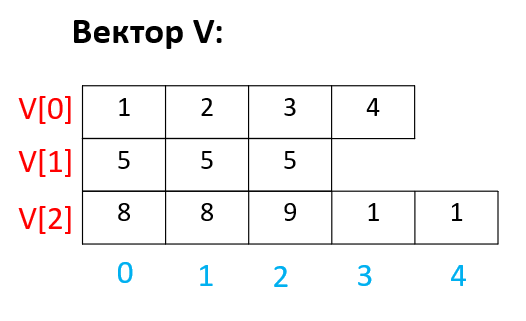

# Вектор төрлийн вектор

Өмнөх хичээлээр бүхэл тоо төрлийн вектор үзсэн бол энэ удаад вектор төрлийн вектор үзье. Энэ нь 2 хэмжээст array-тай төстэй боловч баганын элементүүдийн тоо нь харилцан адилгүй байж болдог.

*Жишээ зураг*
<br>

## Гарааны утга оноох, хэвлэх
vec нь вектор төрлийн вектор бөгөөд 3 вектор агуулж байна. Тиймээс хэмжээ нь 3 байна. vec[i] нь доторх векторуудынх нь хэмжээ. Жишээ нь `vec[0].size()` нь 4 байна.
``` c++
int main()
{
   vector<vector<int>> vec={
                  {1,24,5,6},
                  {2,2},
                  {1,1,1,1,1,12,4}};
   for(int i=0; i<vec.size(); i++){
      for(int j=0; j<vec[i].size();j++){
         cout<<vec[i][j]<<" ";
      }
      cout<<'\n';
   }

   return 0;
}
output: 
1 24 5 6 
2 2 
1 1 1 1 1 12 4
```

## Элемент(Вектор) нэмэх

Тухайн вектор руу тухайн төрлийн утгыг push_back() гишүүн функц ашиглан нэмж болдогийг бид өмнөх хичээлээр судалсан. Тиймээс Вектор төрлийн вектор луу векторыг нэмж болно.

``` c++
int main()
{
    vector<vector<int>> V;
    vector<int> vec = {1,2,3,4};
    V.push_back(vec);
    V.push_back({5,5,5});
    vec = {8,8,9,1,1};
    V.push_back(vec);
    return 0;
}
```

<br> <br>

## Вектор луу элемент нэмэх
Вектор төрлийн векторын хэмжээг n гэж тодорхойлсон гэж үзье. Тэгвэл `0 --> n-1` индекс дээрх элемент(вектор) рүү хандаж болно. 
``` c++
int main()
{
    int n=4;
    vector<vector<int>> V(n);
    V[0].push_back(1);
    V[0].push_back(1);
    V[0].push_back(1);
    V[1].push_back(9);
    cout<<V[0].size()<<endl; //3
    cout<<V[1].size()<<endl; //1
    cout<<V[2].size()<<endl; //0
    cout<<V[3].size()<<endl; //0
    return 0;
}
```
<br> <br>


## Ижил төрлийн мөр баганын тоотой зарлах
Хоёр хэмжээст array-тай адилаар мөр бүрийн(элемент вектор) багана буюу векторуудын хэмжээ адил байхаар зарлаж болно. Жишээ нь 3 вектор нь бүгд тэнцүү 4 хэмжээтэй байхаар үзүүлэв. Мөн бүх элементийг 9 гэсэн гарааны утга оноосон.

``` c++
int main()
{
    vector<vector<int>> vec(3,vector<int>(4,9));
    
    for(int i=0; i<vec.size(); i++){
        for(int j=0; j<vec[i].size();j++){
            cout<<vec[i][j]<<" ";
        }
        cout<<'\n';
    }

    return 0;
}
output: 
9 9 9 9
9 9 9 9
9 9 9 9
```

## Бие даах дасгалууд

<br/>1. 10x10 харьцаатай вектор төрлийн вектор үүсгэнэ. Бүх элементийн утга 1 байх ёстой. Зөв үүсгэсэн эсэхийг хэвлэж шалга.

<br/>2. 10x10 харьцаатай вектор төрлийн вектор үүсгэнэ. Элементүүдийн утга нь 1-100 хүртэл байх ёстой. Зөв үүсгэсэн эсэхийг хэвлэж шалга. Элементүүд 3 хоосон зайд урагш шахагдан хэвлэгдэнэ. Дараах чиглүүлгийг ажиглана уу.

<br/> 1  &nbsp;&nbsp;2 &nbsp;&nbsp; 3 ...  10
<br/> 11 12 13 ... 20 
<br/> ...
<br/> 91 92 93 ... 100

<br/>3. 10 хэмжээтэй вектор төрлийн вектор үүсгэнэ. Эхний вектор 1 хэмжээтэй ба элемент нь 1, дараах вектор нь 2 хэмжээтэй ба элементүүд нь 1 ба 2 , гэх мэтээр 10 дахь вектор нь 10 хэмжээтэй элементүүд нь 1 ээс 10 хүртэл байна. Зөв үүсгэсэн эсэхийг шалгахын тулд элементүүд болон хэмжээг нь хэвлэн харуул.

<br/> 1 
<br/> 1 2 
<br/> 1 2 3
<br/> 1 2 3 4
<br/> ...
<br/> 1 2 3 4 ... 10


<br>4. Гараас n тоо өгөгдөнө. Үүний дараа n ширхэг англи цагаан толгойгоос бүрдсэн үгс өгөгдөнө. Хамгийн их давтагдаж буй үгийн тоог ол. Том жижиг үсгийг адилхан гэж үзнэ.

<br/> 8
<br/> giant 
<br/> Giant
<br/> BMX
<br/> bm
<br/> CanonDALE
<br/> CaNONdale
<br/> Canondale
<br/> bmx

<br/> 3 


(Дутуу бодлогууд)<br>https://kenkoooo.com/atcoder/#/contest/show/3cef52ea-e433-49c0-b319-c523c46886b4 
 