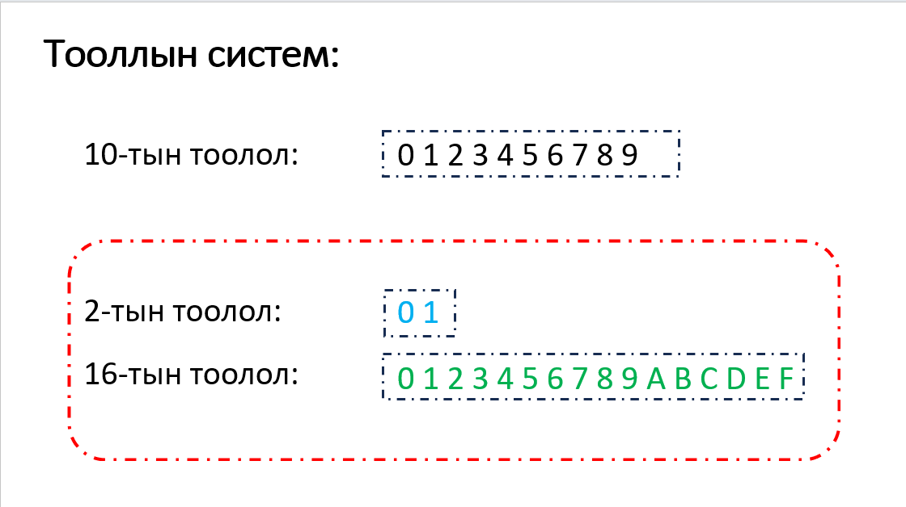
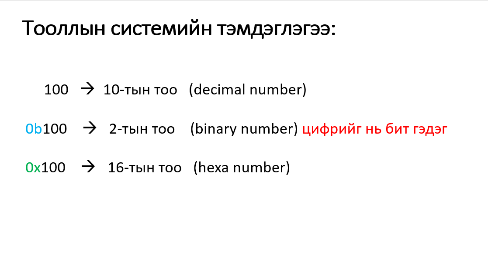
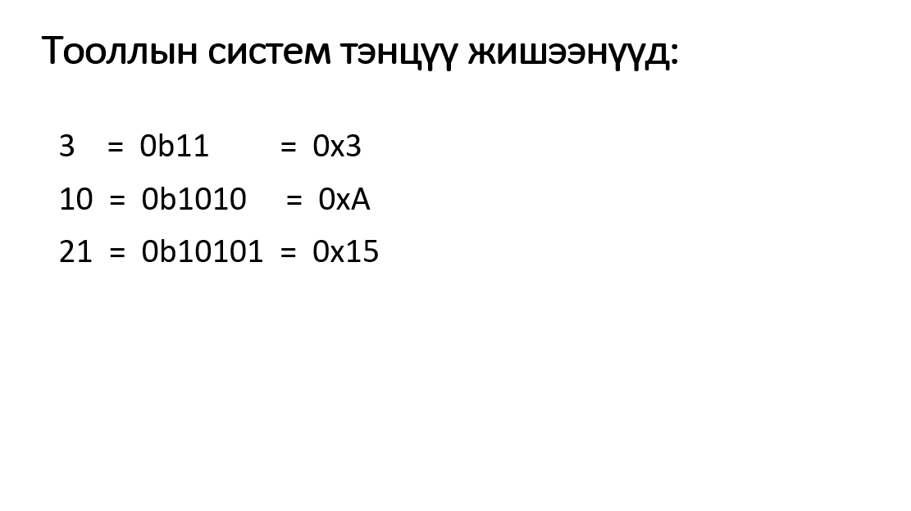
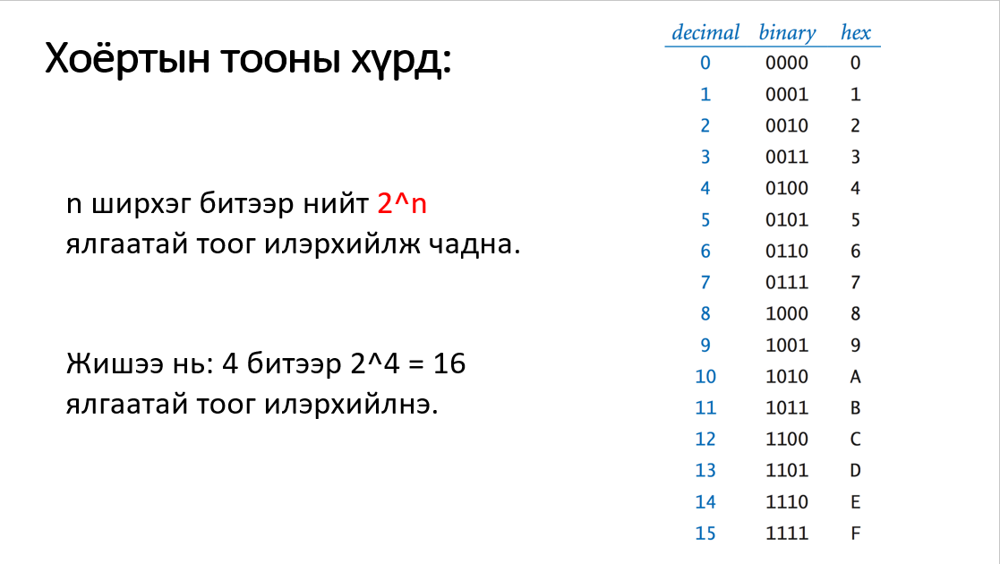
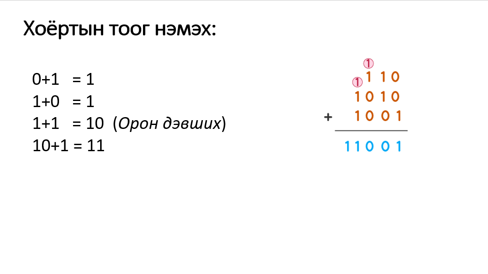
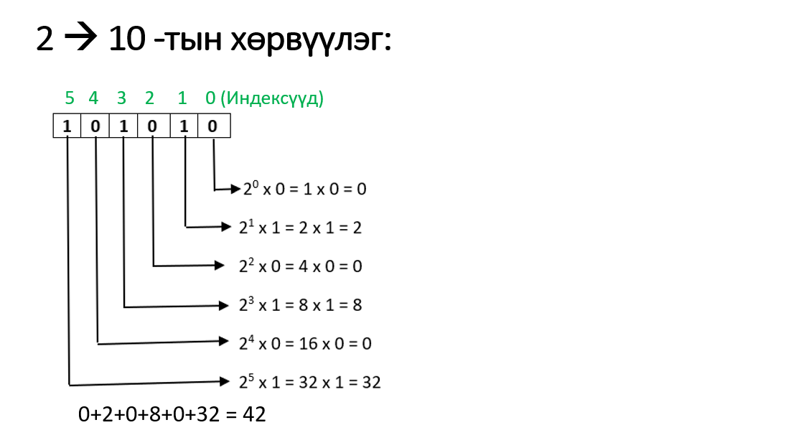
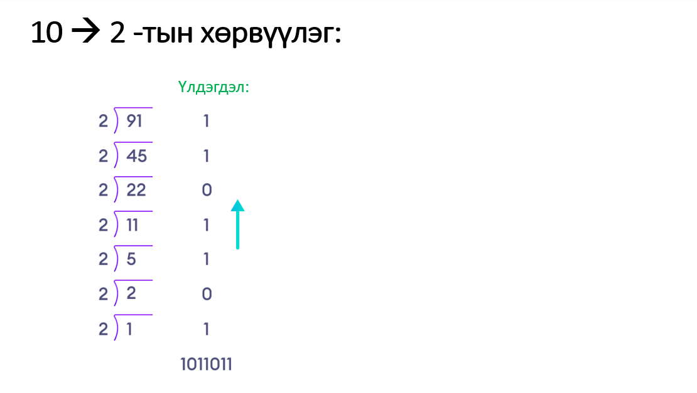
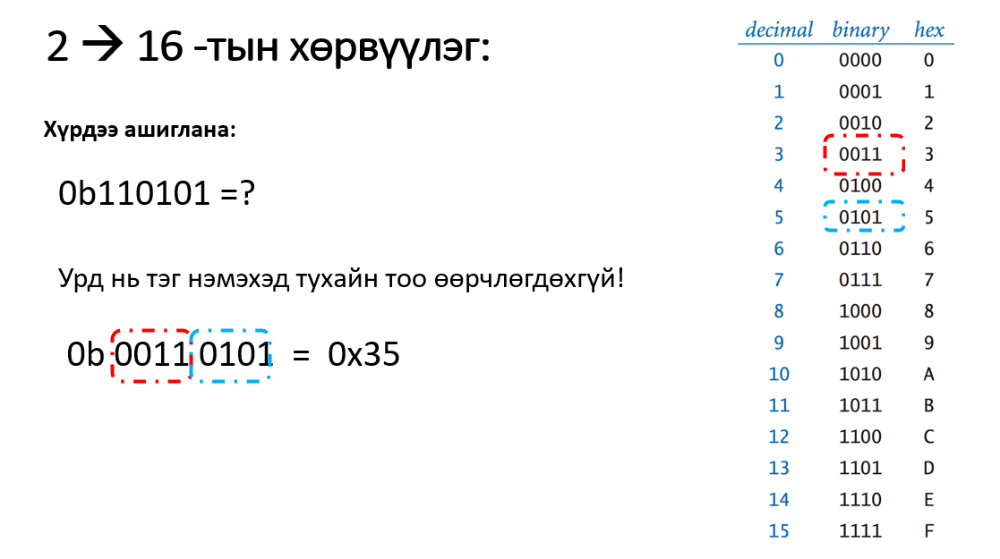
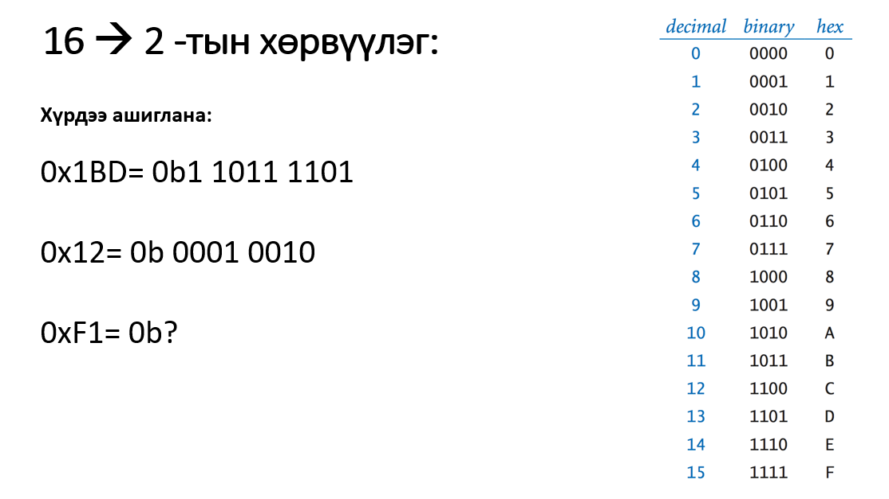

# Тооллын систем











<br> <br>
```c++
int main()
{
    int A = 0b100;
    int B = 0x100;
    int C = 100;
    //Decimal print
    cout<<A<<'\n';  // 4
    cout<<B<<'\n';  // 256
    cout<<C<<'\n';  // 100
    //Hexa print
    cout<<hex<<C;   // 64
    return 0;
}
```

## Бие даах дасгалууд

<br/>1. 77 тоог 2-т, 16-т тооллоор хэдтэй тэнцүүг ол.

<br/>2. 0b10101011101 тоог 10-т, 16-т тооллоор хэдтэй тэнцүүг ол.


<br/>3. Гараас 15 битээс хэтрэхгүй урттай 2-тын тоо өгөгдөнө. Энэ тоог 10-т болон 16-тын тоолол руу хөрвүүлсэн утгыг хэвлэ.

<br/> 00010101011
<br/> 171
<br/> 0xAB
<br/> 
<br/> 100011001010101
<br/> 18005 
<br/> 0x4655
<br/>


<br/>4. Аравтын тоо өгөгдөнө. Түүнийг 2-т болон 16-тын тоолол руу хөрвүүлсэн утгыг хэвлэ.

<br/> 235
<br/> 0b11101011
<br/> 0xEB
<br/> 
<br/> 1024
<br/> 0x400
<br/> 0b10000000000
<br/>

<br>5. Гараас өгсөн бүхэл тоонд хэдэн 1 бит байгааг олж хэвлэнэ. 

<br/> 15
<br/> 4
<br/> 
<br/> 256
<br/> 1
<br/> 


<br>6. Гараас өгсөн бүхэл тоо 2-тын хэлбэрийн хувьд палиндром бол Yes үгүй бол No гэж хэвлэнэ үү.
(Жишээ нь 9 = 0b1001 тул Yes)

<br/> 123
<br/> No
<br/> 
<br/> 34209
<br/> Yes
<br/> 

<br>7. Гараас өгсөн 2 хоёртын тоо өгөгдөнө. Тэдний нийлбэр утгыг хэвлэнэ үү.

<br/> 10101010
<br/> 01010101
<br/> 
<br/> 11111111
<br/> 
<br/> 1010
<br/> 1111101
<br/> 
<br/> 10000111

<br>8. `Mongolia` үгийг 2-тын тооллоор илэрхийл.

