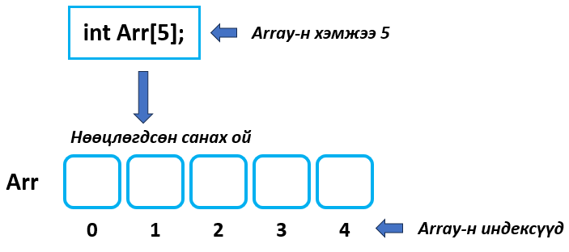

# Нэг хэмжээст Array (Massive, хүснэгт) 
Array бол хамгийн түгээмэл ашиглагддаг өгөгдлийн бүтэцүүдийн нэг юм.

Тодорхой хэмжээтэй ижил төрлийн(int,float,char.. гэх мэт) утгуудыг array -д хадгалдаг. 

Жишээ Array: 

<br>

## Онцлогууд: 
1. Array-ийн утга бүрийг элемент гэж нэрлэнэ. 
2. Элементүүд нь индексээр дугаарлагдсан байна.
3. Индекс нь заавал 0 -с эхэлнэ.
4. Индексээр нь тухайн элементэд утга оноож, утгыг нь уншиж болно.
5. Array -ийг зарлахдаа хэмжээг заавал зааж өгнө. Хэмжээ гэдэг нь нийт хадгалах элементийн тоо юм.  


## Array зарлах
**type Array_name[size];**
<br>

<br><br>
## Array-д анхны утга оноох
**type Array_name[n] = {value1,value2, ... ,valuen};**
<br>

## Array-ийн элемент рүү индексээр хандах
n хэмжээтэй array-н хувьд эхний элементийн индекс 0, сүүлийн элементийн индекс n-1 байна.
 ```c
  Array_name[i] = value;
```
<br>


## Жишээнүүд

```c
//3 хэмжээтэй A Array-т 1 2 3 анхны утга оноох
int main(){
  int A[3] = {1,2,3};
  cout<<A[0]<<" "<<A[1]<<" "<<A[2];
  return 0;
}
```

```c
//3 хэмжээтэй A Array-т индексээр нь 1 2 3 утга оноох
int main(){
  int A[3];
  A[0]=1;
  A[1]=2;
  A[2]=3;
  cout<<A[0]<<" "<<A[1]<<" "<<A[2];
  return 0;
}
```

```c
//10 хэмжээтэй Array-т элемент бүрт нь 1 утга онооё
int main(){
  int A[10];
  for(int i=0;i<10;i++){
    A[i] = 1;
  }
  return 0;
}
```
```c
//10 хэмжээтэй Array-т элемент бүрт нь гараас утга унших
int main(){
  int A[10];
  for(int i=0;i<10;i++){
    cin>>A[i];
  }
  return 0;
}
```
```c
//10 хэмжээтэй Array-ийн элементүүдийг хэвлэх.
int main(){
  int A[10] = {1,2,3,4,4,5,6,6,10,9};
  for(int i=0;i<10;i++){
    cout<<A[i]<<" ";
  }
  return 0;
}
```
```c
//10 хэмжээтэй Array-ийн элементүүдийн нийлбэр.
int main(){
  long long sum =0;
  int A[10] = {1,2,3,4,4,5,6,6,10,9};
  for(int i=0;i<10;i++){
    sum = sum + A[i];
  }
  cout<<sum;
  return 0;
}
```

## Дасгал ажлууд ##

<br>1. Бүхэл тоо төрлийн 5 хэмжээтэй Array зарлаж бүх элемэнтэд нь 9 утга оноо.
<br>2. Бүхэл тоо төрлийн 10 хэмжээтэй Array зарлаж элементүүдэд нь 1-10 хүртэлх утга оноо.
<br>3. Бүхэл тоо төрлийн 1000 хэмжээтэй Array зарлаж элементүүдэд нь 1 - 1000 хүртэлх утга оноо.
<br>4. Бүхэл тоо төрлийн 1000 хэмжээтэй Array зарлаж элементүүдэд нь 1000 - 1 хүртэлх утга оноо.
<br>5. Гараас n(100 -аас ихгүй) тоо өгнө. Үүний дараа n ширхэг бүхэл тоо өгнө. Тэднийг хүснэгтэд хадгалсны дараа, нийлбэрийг нь бодож олно уу. 

**Оролт1:** 
5
78 4 1 58 2

**Гаралт1:**
143

**Оролт2:** 
20
78 4 1 58 2 78 4 1 58 2 78 4 1 58 2 78 4 1 58 2

**Гаралт2:**
572

**Оролт3:** 
17
123 456 789 10 11 12 123 456 789 1157 88 7 6 78 3 78 64

**Гаралт3:**
4250

<br>6. Гараас n(100 -аас ихгүй) тоо өгнө. Үүний дараа n ширхэг бүхэл тоо өгнө. 2 дахь болон n-2 дахь элементүүдийн нийлбэрийг хэвлэ.

**Оролт1:** 
10
1 2 3 4 5 6 7 8 9 10

**Гаралт1:**
10

**Оролт2:** 
17
123 456 789 10 11 12 123 456 789 1157 88 7 6 78 3 78 64

**Гаралт2:**
459

**Оролт3:** 
20
78 4 1 58 2 78 4 1 58 2 78 4 1 58 2 78 4 1 58 2

**Гаралт3:**
5

<br>7. Гараас n(100 -аас ихгүй) тоо өгнө. Үүний дараа n ширхэг бүхэл тоо өгнө. n дэх элементэд хуваагддаг бүх элементүүдийг хэвлэ.Элементүүд давтагдаж болно. Хуваагддаг элемент олдохгүй бол -1 хэвлэ.

**Оролт1:** 
10
1 2 3 4 5 6 7 8 9 10

**Гаралт1:**
-1

**Оролт2:** 
20
78 4 1 58 2 78 4 1 58 2 78 4 1 58 2 78 4 1 58 2

**Гаралт2:**
78 4 58 2 78 4 58 2 78 4 58 2 78 4 58 2

**Оролт3:** 
20
78 4 1 58 2 78 9 1 58 2 78 4 1 58 2 78 4 1 58 3

**Гаралт3:**
78 78 9 78

<br>8. Гараас n(100 -аас ихгүй) ба k тоонууд өгөгдөнө. Үүний дараа n ширхэг бүхэл тоо өгнө. k тоо хэд дэх индекс дээр байгааг хэвлэ. k тоо олон удаа олдвол бүх индексийг хэвлэ. Хэрэв олдохгүй бол -1 хэвлэ. 

**Оролт1:** 
10 78
1 2 3 4 5 6 7 8 9 10

**Гаралт1:**
-1

**Оролт2:** 
10 8
1 2 3 4 5 6 7 8 9 10

**Гаралт2:**
7

**Оролт3:** 
20 58
78 4 1 58 2 78 9 1 58 2 78 4 1 58 2 78 4 1 58 3

**Гаралт3:**
3 8 13 18

<br>9. Гараас n(100 -аас ихгүй) тоо өгөгдөнө. Үүний дараа n ширхэг бүхэл тоо өгнө. Тэдгээр тоонуудын хамгийн их утгыг хэвлэ.

**Оролт1:** 
10 
1 2 3 4 55 6 7 8 9 10

**Гаралт1:**
55

**Оролт2:** 
15 
1 222 3 4 55 6 7 8 9 10 88 95 78 1 6

**Гаралт2:**
222

**Оролт3:** 
20
78 4 1 58 2 78 9 1 58 2 78 4 1 58 2 78 4 1 58 3

**Гаралт3:**
78

<br>10. Гараас n(100 -аас ихгүй) тоо өгөгдөнө. Үүний дараа n ширхэг бүхэл тоо өгнө. Тэднийг Array-т хадгалж хамгийн их болон бага утгуудыг олж хэвлэнэ үү.

**Оролт1:** 
10 
1 2 3 4 55 6 7 8 9 10

**Гаралт1:**
55 1

**Оролт2:**
15 
2 222 3 4 55 6 7 8 9 10 88 95 78 2 6

**Гаралт2:**
222 2

**Оролт3:**
20
78 4 0 58 2 78 9 0 58 2 78 4 0 58 2 78 4 0 58 3

**Гаралт3:**
78 0

<!-- <br>11. Гараас n(100 -аас ихгүй) тоо өгөгдөнө. Үүний дараа n ширхэг бутархай тоо өгнө. Тэднийг Array-т хадгалж арифметик дунджыг тасаллаас хойш 3 ороны нарийвчлалтай хэвлэ.
Оролт:  -->


