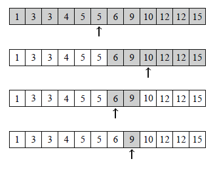
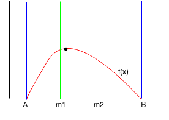

# Binary search

Бодлого: Үл буурах n ширхэг натурал тоо өгөгдсөн. Энэ тоон дунд x тоо байгаа эсэхийг ол.

## бодох арга
Байх боломжтой утгуудын голын тоог сонгоод x-тэй харьцуулаад тэнцүү байвал байгаа гэсэн үг. Хэрэв сонгосон тоо нь бага байвал x баруун талд нь, их байвал зүүн талд нь байна гэсэн үг. Нэг удаагын үйлдэл хийх болгонд х-ийн байж болох газар нь 2 дахин багасна.

9 байгаа эсэхийг шалгасан жишээ: 

```cpp
vector<int> arr(n);
int x = 9;
int l = -1;
int r = n;
while(r-l>1){
    int mid = (r+l)/2;
    if(arr[mid]==x){
        //x too oldson
    }
    if(arr[mid]<x)  l = mid+1;
    else r = mid-1;
}

```

Үл буурах(үл өсөх) шинж чанартай f(x)-ийн хувьд binary search ашиглаж болно.

Binary search-ийг ерөнхий тохиолдолд кодыг нь бичвэл
```cpp
int ok = -1;
int ng = n;
while(ng-ok>1){
    int mid = ok+(ng-ok)/2;
    if(check(mid)){
        ok = mid;
    } else {
        ng = mid;
    }
}

bool check(x){
    //нөхцлийг хангаж байвал True
    //бусад үед False буцаадаг функц.
    //Дээрхи жишээний хувьд
    //return arr[x]<=x
}
```
дээрхи код ажиллаж дуусахад
* ok - нөхцлийг хангах хамгийн том тоо нь
* ng - нөхцлийг хангахгүй хамгийн бага тоо нь 
орсон байна.

stl дотор lower_bound(), upper_bound() гэсэн 2 binary search хйидэг функц бий.

| function | explanation |
|---|---|
|lower_bound(arr.begin(),arr.end(),x)| үл буурах arr вектор дотроос x-ээс их юм уу тэнцүү хамгийн бага гишүүнийг заасан iterator(pointer) буцаана. |
|upper_bound(arr.begin(),arr.end(),x)| үл буурах arr вектор дотроос x-ээс эрс их, хамгийн бага гишүүнийг заасан iterator(pointer) буцаана. |

<br>
<br>
Бодлого1(800): https://codeforces.com/problemset/problem/750/A
<br>
Бодлого2(800): https://codeforces.com/problemset/problem/1566/A
<br>
Бодлого3: Өгөгдсөн эерэг бүхэл тооны куб зэргийн язгуурыг ол. Алдаа нь 10<sup>-6</sup>-ээс бага байх хэрэгтэй.
<br>
Бодлого4(1600): https://codeforces.com/problemset/problem/1730/B

# Ternary search
y = f(x)-ийн хамгийн их(бага) утгыг олдог алгоритм.

Binary search- тэй төстэй ч дараах шинж чанар нь өөр.
* f(x) нь эрс өсөөд(буураад) хамгийн их утгаа авсны дараа эрс буурдаг(өсдөг).
* боломжит утгын хэсгийг 2 биш 3н тэнцүү хэсэгт хуваана.



Алгоритм:
1. [A,B] хооронд max цаг нь байгаа гэж үзье.
2. [A,m1], [m1,m2], [m2,B] гэсэн 3н тэцүү хэсэгт хуваана.
3. f(m1)==f(m2) байвал A=m1,B=m2 болгоод 1.дэх үйлдлээс дахин давтана.
4. f(m1)>f(m2) байвал [m2,B] гэсэн хэсэг нь эрс буурах хэсэг тул маx утга энэ хэсэгт байхгүй. B=m2 болгоод 1.дэх үйлдлээс дахин давтана.
5. f(m1)<f(m2) байвал [A,m1] гэсэн хэсэг нь эрс өсөх хэсэг тул маx утга энэ хэсэгт байхгүй. A=m1 болгоод 1.дэх үйлдлээс дахин давтана.

Жишээ бодлого: Эрс өсөх дарааллын ард, эрс буурах дарааллыг нийлүүлсэн дараалал дунд х тоо байгаа эсэхийг ол.

```cpp
int x;
int l = 0;
int r = n;
while(r>=l){
    int m1 = l + (r-l)/3;
    int m2 = r - (r-l)/3;
    if(arr[m1]==x) return m1;
    if(arr[m2]==x) return m2;
    if(arr[m1]==arr[m2]) {
        l = m1;
        r = m2;
    }
    else if(arr[m1]>arr[m2]){
        r = m2;
    } else {
        l = m1;
    }
    return -1; //not found
}
```

Бодлого5(1100): https://codeforces.com/problemset/problem/1288/A

Бодлого6(1600): https://codeforces.com/problemset/problem/1730/B


