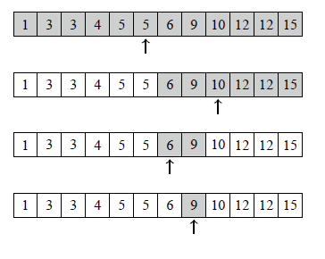

# Binary search

Бодлого: Үл буурах n ширхэг натурал тоо өгөгдсөн. Энэ тоон дунд x тоо байгаа эсэхийг ол.

## бодох арга
Байх боломжтой утгуудын голын тоог сонгоод x-тэй харьцуулаад тэнцүү байвал байгаа гэсэн үг. Хэрэв сонгосон тоо нь бага байвал x баруун талд нь, их байвал зүүн талд нь байна гэсэн үг. Нэг удаагын үйлдэл хийх болгонд х-ийн байж болох газар нь 2 дахин багасна.

9 байгаа эсэхийг шалгасан жишээ: 

```cpp
vector<int> arr(n);
int x = 9;
int l = -1;
int r = n;
while(r-l>1){
    int mid = (r+l)/2;
    if(arr[mid]<x)
        l = mid;
    else
        r = mid;
}
if(arr[r]==x){
    //x too oldson
} else {
    //x too oldoogui
}
```

Үл буурах(үл өсөх) шинж чанартай f(x)-ийн хувьд binary search ашиглаж болно.

Binary search-ийг ерөнхий тохиолдолд кодыг нь бичвэл
```cpp
int ok = -1;
int ng = n;
while(ng-ok>1){
    int mid = ok+(ng-ok)/2;
    if(check(mid)){
        ok = mid;
    } else {
        ng = mid;
    }
}

bool check(x){
    //нөхцлийг хангаж байвал True
    //бусад үед False буцаадаг функц.
    //Дээрхи жишээний хувьд
    //return arr[x]<=x
}
```
дээрхи код ажиллаж дуусахад
* ok - нөхцлийг хангах хамгийн том тоо нь
* ng - нөхцлийг хангахгүй хамгийн бага тоо нь 
орсон байна.

stl дотор lower_bound(), upper_bound() гэсэн 2 binary search хйидэг функц бий.

| function | explanation |
|---|---|
|lower_bound(arr.begin(),arr.end(),x)| үл буурах arr вектор дотроос x-ээс их юм уу тэнцүү хамгийн бага гишүүнийг заасан iterator(pointer) буцаана. |
|upper_bound(arr.begin(),arr.end(),x)| үл буурах arr вектор дотроос x-ээс эрс их, хамгийн бага гишүүнийг заасан iterator(pointer) буцаана. |

<br>
<br>
Бодлого1(800): https://codeforces.com/problemset/problem/750/A
<br>
Бодлого2(800): https://codeforces.com/problemset/problem/1566/A
<br>
Бодлого3: Өгөгдсөн эерэг бүхэл тооны куб зэргийн язгуурыг ол. Алдаа нь 10<sup>-6</sup>-ээс бага байх хэрэгтэй.
<br>
Бодлого4(1600): https://codeforces.com/problemset/problem/1730/B


https://kenkoooo.com/atcoder/#/contest/show/9542f709-9054-4204-954e-f5ab20720b35