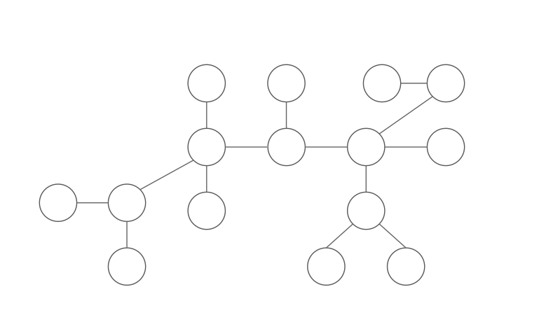
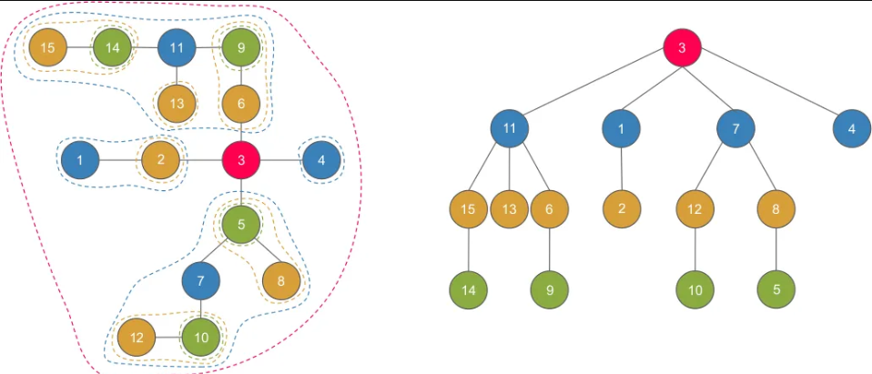

# Centroid
Тухайн модны массын төв гэж хэлж болохоор.
Тухайн оройг устгахад үлдсэн граф нь салангид хэдэн connected component болж задрах ба аль нь ч N/2 оройгоос бага байдаг орой.



Шинж чанар:
1. Ямар ч мод нь дор хаяж нэг centroid-той байна.
2. Centroid-г устгахад 2 өөр connected component-д орж байгаа 2 оройг холбосон path нь заавал centroid-ийг дайрна.

# Centroid  decomposition
Модны centroid нь түүний root байна. 
Түүний child нь centroid-ыг устгахад үүсэх дэд моднуудын centroid нь байна. Гэх мэтчилэн бүх оройг centroid болтол дээрхи үйлдлийг гүйцэтгэхэд үүсэх модыг Centroid decomposition гэнэ.



Шинж чанар:
1. Анхны модны оройг агуулсан байна.
2. Centroid decomposition-ий өндөр нь хамгийн ихдээ log(N) байна.
   Өндөр нь 1-ээр буурахад оройн тоо нь дор хаяж 2 дахин багасах учраас өндөр нь log(N)-ээр буурахад оройн тоо нь 1-ээс бага болсон байна.
3. a болон b оройн хоорондох зай нь Centroid decomposition мод дээрх LCA(a,b) оройг с гэвэл dist(a,b) = dist(a,c)+dist(c,b)-тэй тэнцүү байна.
   LCA(a,b)-г устгахад a болон b салангид 2 хэсэгт орно. Хэрвээ салангид хэсэгт орохгүй бол тэр хэсгийнх нь centroid нь LCA(a,b) болж таарна. a b 2ыг холбох замд нь заавал LCA(a,b) байх учраас dist(a,b) = dist(a,c)+dist(c,b) байна.
4. (Хамгийн гол)Анхны модны бүх боломжит хосуудын хоорондох зай нь centroid decomposition-ийн parent-ууд хүртэлхи бүх боломжит зайнууд болох N * lg(N) боломжит зайнууд дундаас 2-ийг нь нэмсэнтэй тэнцүү байна.(1-р чанараас)


жишээ бодлого: https://codeforces.com/problemset/problem/342/E


# Source code template
```cpp

vvll e;	//horshuudiin jagsaalt
ll n, m;//oroin too, irmegiin too
vll sz;	//ded modnii hemjee
vector<char> removed;//ug oroig ustgasan eseh
//centroid decomposition hiisnii daraah 
// ancestor bolgon luu her hol baigaag sanuulna.
vector<vpll> anc;

//ind oroin ded modnii hemjeeg oloh dfs
ll get_sz(ll ind, ll par = -1) {
	sz[ind] = 1;
	for (auto v : e[ind]) {
		if (v == par || removed[v]) continue;
		sz[ind] += get_sz(v, ind);
	}
	return sz[ind];
}

//ind-tei holbootoi hesgiin hundiin toviig oloh
ll get_centroid(ll ind, ll par, ll tree_size) {
	ll n2 = tree_size / 2;
	for (auto v : e[ind]) {
		if (removed[v] || v == par) continue;
		if (sz[v] > n2) {
			return get_centroid(v, ind, tree_size);
		}
	}
	return ind;
}

//oroi bolgonii huvid centroid bolgon hurtelhi zaig sanuulna.
void get_dists(ll ind, ll par, ll centr, ll dst) {
	for (auto v : e[ind]) {
		if (removed[v] || v == par) continue;
		get_dists(v, ind, centr, dst + 1);
	}
	anc[ind].push_back({centr,dst});
}

//centroid decomposition hiine.
void build_centroid_decomp(ll ind) {
	//ded modnii hemjeenuudiig tootsoh
	get_sz(ind);
	ll centr = get_centroid(ind,-1,sz[ind]);
	removed[centr] = true;
	for (auto v : e[centr]) {
		if (removed[v]) continue;
		get_dists(v,centr,centr,1);
	}
	for (auto v : e[centr]) {
		if (removed[v]) continue;
		build_centroid_decomp(v);
	}
}

void solve(){
   ll u,v;
   cin>>n>>m;
   e.resize(n);
   sz.resize(n);
   removed.resize(n);
   anc.resize(n);f
   for(int i=0;i<m;i++){
      cin>>u>>v;
      u--,v--;//index starts 0
      e[u].push_back(v);
      e[v].push_back(u);
   }
   build_centroid_decomp(0);

   //solve your problem
}


```


source: https://medium.com/carpanese/an-illustrated-introduction-to-centroid-decomposition-8c1989d53308