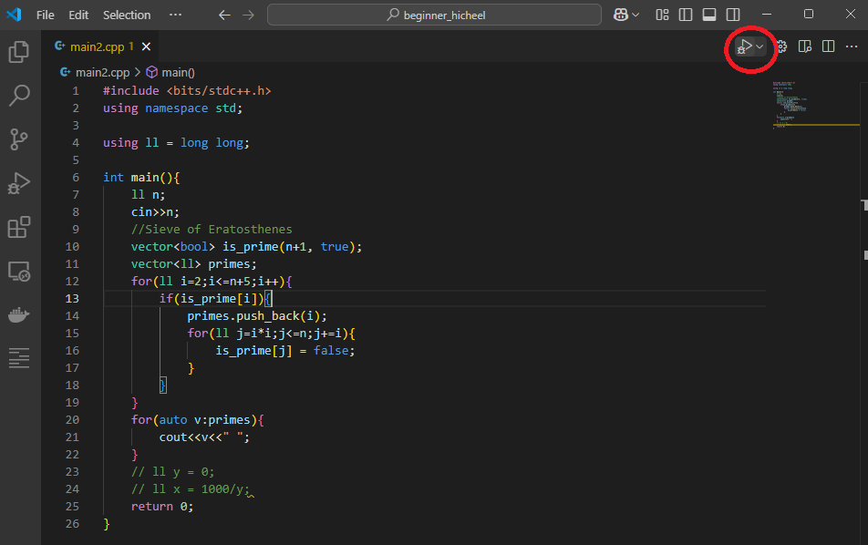
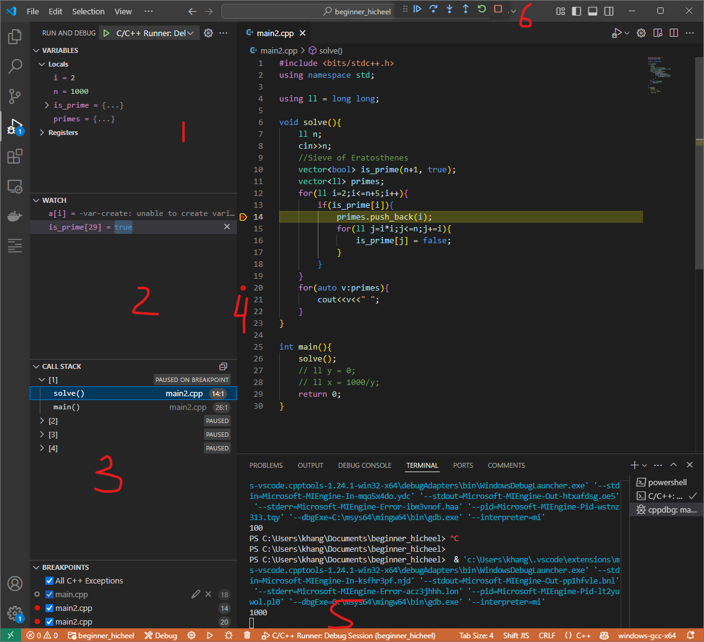

# C++ Debug хийх

Debug хийхэд доорхи 2-ийг ашиглахад илүү амар.
1. Visual studio community
    Татаж аваад суулгахад л хангалттай.
    Нилээн том хэмжээтэй ч ашиглахад хялбар 
2. Visual studio code
    [Орчин бэлдэх заавар](vscode_environment.md)
3. Анхан шатны бодлогуудыг бол [Visualizer](https://www.codechef.com/cpp-online-compiler) ашиглахад илүү амар.

4. Dev-C++ дээр debug хийхэд төвөгтэй эсвэл crash хийх нь их. 
<br>
# Visual studio code ашиглаж debug хийх

1. Зураг дээрхи Товч эсвэл [Debug C/C++ file]-ийг сонгоод дарна.
   
2. Debug хийхэд доорхи цонх харагдана.
   
   1. Variables
   Хувьсагчууд болон одоо байгаа утгууд нь харагдана.
   2. Watch
   Дурын тэгшитгэл бичээд ямар утгатай байгааг нь харж болно.
   3. Call stack
   Одоо зогсож байгаа(шараар тэмдэглэгдсэн мөр) код ажиллах хүртэл дуудагдсан функцууд, тухайн функцын хэддүгээр мөрийг нь ажиллуулж байгаа мэдээлэл байна.  
   Call stack жагсаалтаас аль нэгийг нь сонгоход тэр мөр функцээс харж болох local хувьсагчуудын ямар утгатай байгааг нь харж болно.
   4. Breakpoint
   Програм нь breakpoint(улаан цэгтэй мөр) тавьсан мөрний кодыг ажиллуулах үедээ pause хийдэг. Програмаа нягт шалгамаар байгаа газраа breakpoint тааруулаад, 1,1 командаар нь ажиллуулж зөв ажиллаж байгааг нь шалгахад ихэнхидээ ашигладаг.
   5. Terminal
   Програмынх нь input/output нь энд харагдаж, оролтоо энд бичнэ.
   6. Control buttons
   Кодоо үргэлжлүүлэн ажиллуулах, 1 комманд ажиллуулах, дараагын мөр болтол ажиллуулах, одоо ажиллаж байгаа функцыг дуустал ажиллуулаад зогсоох, кодоо эхнээс нь ажиллуулах, debug зогсоох гэсэн товчнууд.

# Visual studio community ашиглаж debug хийх
  VSCode-той ер нь бол төстэй. Илүү exception барьж авахдаа сайн, илүү UX сайтай.
  Compiler нь GCC биш учраас ```bits/stdc++.h``` ашиглаж чадахгүй. Тус бүрийн header-ийг include хийж өгөх хэрэгтэй.
  ```cpp
    #include <iostream>
    #include<string>
    #include<algorithm>
    #include<functional>
    #include<cmath>
    #include<queue>
    #include<vector>
    #include<map>
    #include<stack>
    #include<list>
    #include<deque>
    #include<set>
    #include<unordered_set>
    #include<unordered_map>
    #include<numeric>
    #include<bitset>
    #include<iomanip>
    #include<cstdlib>
    #include<time.h>
    #include <functional>
    #include <chrono>
    #include <thread>
    #include <fstream>
    #include <random>   
  ```
  
  Demo