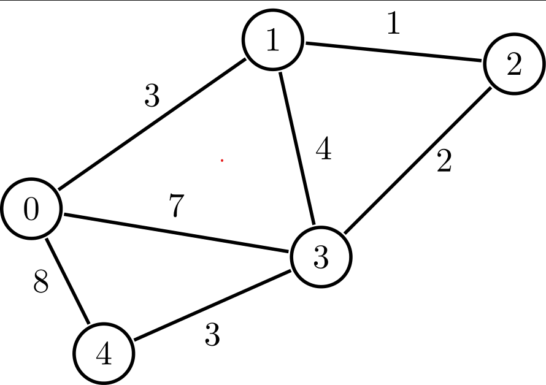

# Graph

Граф нь G = {V,E}-ээр тодорхойлогдоно. V нь граф дотор байгаа оройн олонлог, E нь тэдгээл оройг холбосон ирмэгүүдийн олонлог.


Дээрхи графын хувьд 
V = {0,1,2,3,4}
E = {{0,1},{0,3},{0,4},{2,3},{3,4},{2,2}}

Графийг програм дээр дүрслэх, сануулахдаа ихэвчлэн 2 төрлийн аргаар сануулдаг.
1. Хөршүүдийн жагсаалт(Adjacency-list representation)
u оройн хувьд u-тай холбоотой бүх оройг E[u] дотор хадгалах.Өөрөөр хэлбэл E[u] вектор(set,map,vector-ч байж болно.) дотор u-тай хөрш бүх оройнуудыг хадгална. E нь 2 хэмжээст вектор гэсэн үг.
Жишээ нь дээрхи граф нь доорхи хэлбэртэй болно.
```cpp
vector<vector<int>> e = {
    {1,3,4},//0-tei holbootoi oroinuud
    {0},    //1-tei holbootoi oroinuud
    {3,2},    //2-toi holbootoi oroinuud
    {0,4,2},//3-tai holbootoi oroinuud
    {0,3}   //4-tei holbootoi oroinuud
};
```
Энэ хэлбэр нь граф нь сийрэг(ирмэгийн тоо нь бага) үед илүү ашигтай ба ихэнхи тохиолдолд энэ аргыг ашиглах нь илүү үр дүнтэй байдаг.

2. холболтын матриц(Adjacency-matrix representation)
|V|=n үед n * n хэмжээтэй 2D вектор болох E дотор бүх ирмэгийг хадгална. Хадгалахдаа u,v 2 оройн хоорондох ирмэгийн мэдээлэл нь E[u,v] болон E[v,u] дотор хадгална.
Жишээ нь дээрхи граф нь доорхи хэлбэртэй болно.
```cpp
//жишээ нь холбоотой оройг 1-ээр, холбоогүй бол 0-ээр тэмдэглэв.
vector<vector<int>> e = {
    {0,1,0,1,1},
    {1,0,0,0,0},
    {0,0,1,1,0},
    {1,0,1,0,1},
    {1,0,0,1,0}
};
```
Энэ хэлбэр нь граф нь шигүү үед(ирмэгийн тоо нь |V|^2 ойролцоо) үед ашиглавал зүгээр.

Графын ирмэгүүд нь дараах шинж чанартай байдаг графууд түгээмэл ашиглагддаг.
* чиглэлтэй эсэх
  * чиглэлгүй(undirected graph,дээрхи граф нь энэ төрөл)
  * чиглэлтэй ирмэг(directed graph)

* жинтэй эсэх
  * жинтэй (weighted graphs)

  * өөртэйгөө холбогдсон(self loop, хамгийн эхний жишээн дээр {2,2} ирмэг)

```
Дасгал 1:
0,1,2...,N-1 оройтой граф өгөгдөнө. Мөн M ширхэг ирмэг өгөгдөнө. өгөгдсөн графыг хөршүүдийн жагсаалт аргаар илэрхийлээд үр дүнг нь хэвлэ.
Эхний мөрөнд N болон M тоо өгөгдөнө. Дараагын М мөр болгонд u,v гэсэн 2 тоо өгөгдөх ба энэ нь u,v 2 орой ирмэгээр холбогдсонг илтгэнэ.
Оролт:
N M
u[1] v[1]
...
u[M] v[M]

оролт1:
5 6
0 1
0 3
0 4
3 4
3 2
2 2
гаралт1:
1 3 4
0
3 2
0 4 2
0　3

оролт2:
7 6
0 1 
1 2
2 3 
3 4
4 5
5 6

гаралт2:
1
0 2
1 3
2 4
3 5
4 6
5
```

```
Дасгал 2:
0,1,2...,N-1 оройтой граф өгөгдөнө. Мөн M ширхэг ирмэг өгөгдөнө. өгөгдсөн графыг холболтын матриц аргаар илэрхийлээд үр дүнг нь хэвлэ.
Эхний мөрөнд N болон M тоо өгөгдөнө. Дараагын М мөр болгонд u,v гэсэн 2 тоо өгөгдөх ба энэ нь u,v 2 орой ирмэгээр холбогдсонг илтгэнэ.
Оролт:
N M
u[1] v[1]
...
u[M] v[M]

оролт1:
5 6
0 1
0 3
0 4
3 4
3 2
2 2
гаралт1:
0 1 0 1 1
1 0 0 0 0
0 0 1 1 0
1 0 1 0 1
1 0 0 1 0

оролт2:
7 6
0 1 
1 2
2 3 
3 4
4 5
5 6

гаралт2:
0 1 0 0 0 0 0
1 0 1 0 0 0 0
0 1 0 1 0 0 0
0 0 1 0 1 0 0
0 0 0 1 0 1 0
0 0 0 0 1 0 1
0 0 0 0 0 1 0
```

Дасгал3:
Доорхи графыг хөршүүдийн жагсаалт аргаар илэрхийл.


Дасгал4:
Доорхи графыг хөршүүдийн жагсаалт аргаар илэрхийл.
