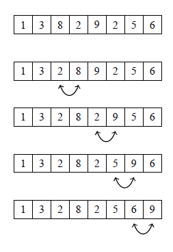
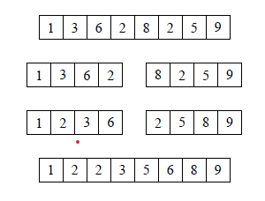

# Sorting

Өгөгдсөн тоон дарааллыг өсөх эрэмбээр нь байрлуул.

Эхлээд хэд хэдэн sort хийдэг алгоритм үзье.

## Bubble sort

Зэргэлдээ 2 элементийг харьцуулаад хэрвээ байрыг нь солих шаардлагатай бол байрлалыг нь солиод явна. Ямар ч үйлдэл хийх боломжгүй болсон үед sort хийж дуусна.
```cpp
for(int i=0;i<n;i++){
    for(int j=0;j<n-1;j++){
        if(arr[j]>arr[j+1]){
            swap(arr[j],arr[j+1]);
        }
    }
}
```
Дээрхи код дотор 2 loop явж байгаа учир time complexity нь O(n<sup>2</sup>) болно. 
Доторхи loop 1 удаа ажиллаж дуусахад хамгийн том элемэнт байрандаа очсон байна. 2дохоо ажиллаж дуусахад 2дох том элемент нь байрандаа очсон байна....

<br><br>

## Merge sort

Алгоритм
* 1 урттай дараалал бол аль хэдийн сорт хийгдсэн байна гэсэн үг.
* Дарааллыг голын элементээр 2 дараалал болгон хуваана.
* 2 дарааллаа адилхан алгоритм ашиглан сорт хийнэ.
* Сорт хийсэн 2 дарааллаа хооронд нийлүүлнэ. Нийлүүлэхдээ 2 дарааллын хамгийн урд талын элементүүдийг харьцуулаад аль багыг нь шинэ дарааллынхаа ард нь нэмээд явна. Үүссэн шинэ дараалал нь сорт хийгдсэн байна.
  
  

Сорт хийгдсэн 2 дарааллыг нийлүүлэхэд нийтдээ O(n) үйлдэл хэрэгтэй. Нийт хэдэн удаа 2 дараалалд хуваах үйлдлийн тоо нь log(n) байна. Тийм учраас энэхүү алгоритмын time complexity нь O(n*log(n)) болно.

Үүнээс гадна Selection sort, Insertion Sort, Quick Sort алгоритмууд бий.

## C++ хэл дээр 

Ихэнхи програмын хэл дээр бэлэн сорт хийх функцууд бий. Ихэнхи нөхцөлд өөрөө сорт хийх функц бичсэнээс бэлэн байгаа функцийг нь ашиглах нь алдаа багатай, хурдан байх болно.
C++ хэл дээр sort() гэсэн функц бий.
```cpp
vector<int> a = {1,5,2,300,4,3,2};
//vector-ийг өсөх эрэмбээр нь сорт хийхдээ
sort(a.begin(),a.end());    //{1,2,2,3,4,5,300}
//vector-ийг буурах эрэмбээр нь сорт хийхдээ
sort(a.rbegin(),a.rend());  //{300,5,4,3,2,2,1}

int b[7] = {1,5,2,300,4,3,2};
//array-г өсөх эрэмбээр сорт хийхдээ
sort(b,b+7);        //{1,2,2,3,4,5,300}

string s = "khangai";
//string-ийг өсөх эрэмбээр нь сорт хийхэд
sort(s.begin(),s.end());    //"aaghikn"
```

sort() function Нь "<" үйлдлийг ашиглаж сорт хийж байгаа. Гэхдээ энэ харьцуулах функцийг өөрөө тодорхойлж болно.
Жишээ нь string-үүдийг хамгийн бага урттайгаас нь их урттай руу нь, урт нь адилхан үед цагаан толгойн дарааллаар нь эрэмбэлэх үед
```cpp
bool comp(string a, string b){
    if(a.size()==b.size()) return (a<b);
    else return (a.size()<b.size());
}

vector<string> s = {"some","aaaaaaaaa","text","for","sorting"};
sort(s.begin(),s.end(),comp);
//s = {for,some,text,sorting,aaaaaaaaa};
```

vector-ийн compare хийх нь string-тэй адилхан.
vector-ийн эхний элементээс нь эхлээд шалгахад ялгаатай элемент таарвал аль бага утгатай нь бага гэсэн үг.
```cpp
vector\<vector\<int\>\> b = \{\{1,20,30\},\{3,4\},\{1,20\}\};
sort(b.begin(),b.end());
//b = {{1,20},{1,20,30},{3,4}} болно.

```
Өөрийн функцээ ашиглаж сорт хийж бас болно.
2 дох элементээр нь сорт хийх үед
```cpp
vector<vector<int>> b = {{1,20,30},{3,4},{1,20}};
sort(b.begin(),b.end(),[&](vector<int> a, vector<int> b){
    return (a[1]==b[1])?(a[0]<b[0]):(a[1]<b[1]);
});
//b = {{3,4},{1,20,30},{1,20}} болно.
```

Бодлого1( 800): https://codeforces.com/problemset/problem/1742/B

Бодлого2( 900): https://codeforces.com/problemset/problem/1771/A

Бодлого3(1200): https://codeforces.com/problemset/problem/1650/C

Бодлого4(1900): https://codeforces.com/problemset/problem/22/D

Бодлого5( 800): https://codeforces.com/problemset/problem/1626/A

Бодлого6(1000): https://codeforces.com/problemset/problem/1713/B

Бодлого7(1200): https://codeforces.com/contest/1294/problem/B

Бодлого8( 900): https://codeforces.com/problemset/problem/1697/B

Бодлого9( 900): https://codeforces.com/problemset/problem/1584/C


