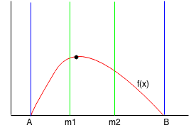

# Ternary search
y = f(x)-ийн хамгийн их(бага) утгыг олдог алгоритм.

Binary search- тэй төстэй ч дараах шинж чанар нь өөр.
* f(x) нь эрс өсөөд(буураад) хамгийн их утгаа авсны дараа эрс буурдаг(өсдөг).
* боломжит утгын хэсгийг 2 биш 3н тэнцүү хэсэгт хуваана.



Алгоритм:
1. [A,B] хооронд max цаг нь байгаа гэж үзье.
2. [A,m1], [m1,m2], [m2,B] гэсэн 3н тэцүү хэсэгт хуваана.
3. f(m1)==f(m2) байвал A=m1,B=m2 болгоод 1.дэх үйлдлээс дахин давтана.
4. f(m1)>f(m2) байвал [m2,B] гэсэн хэсэг нь эрс буурах хэсэг тул маx утга энэ хэсэгт байхгүй. B=m2 болгоод 1.дэх үйлдлээс дахин давтана.
5. f(m1)<f(m2) байвал [A,m1] гэсэн хэсэг нь эрс өсөх хэсэг тул маx утга энэ хэсэгт байхгүй. A=m1 болгоод 1.дэх үйлдлээс дахин давтана.

Жишээ бодлого: Эрс өсөх дарааллын ард, эрс буурах дарааллыг нийлүүлсэн дараалал дунд х тоо байгаа эсэхийг ол.

```cpp
int x;
int l = 0;
int r = n;
while(r>=l){
    int m1 = l + (r-l)/3;
    int m2 = r - (r-l)/3;
    if(arr[m1]==x) return m1;
    if(arr[m2]==x) return m2;
    if(arr[m1]==arr[m2]) {
        l = m1+1;
        r = m2-1;
    }
    else if(arr[m1]>arr[m2]){
        r = m2-1;
    } else {
        l = m1+1;
    }
    return -1; //not found
}
```

Бодлого5(1100): https://codeforces.com/problemset/problem/1288/A

Бодлого6(1600): https://codeforces.com/problemset/problem/1730/B

