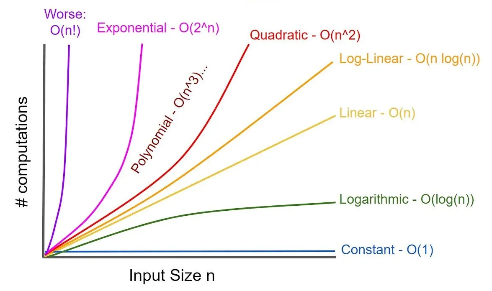

# Time Complexity гэж юу вэ?
Бодлого бодох санаагаа олоод, олсон аргынхаа дагуу код бичтэл хангалттай хурдан биш, хугацаандаа амжихгүй байвал яах вэ?

Үүнээс сэргийлэхийн тулд өөрийн бодож олсон алгоритмаа хэр хурдан бэ гэдгийг тооцож чаддаг байх нь чухал. Алгоритмынхаа ажиллах цагыг тооцоход time complexity-г ашигладаг. Тооцож чаддаг болсноор кодоо бичихээсээ өмнө бодлогын цагт нь амжих эсэхээ тодорхойлж чаддаг болно.

## time complexity гэдэг нь
Алгоритмын өгсөн оролтын хувьд ойролцоогоор хэр их хугацаа зарцуулах вэ гэдгийг нь илтгэнэ. Тэмдэглэхдээ O(...) гэж тэмдэглэдэг. 
...-ийн оронд ихэвчлэн оролтын хэмжээ байдаг. 
Жишээ нь вектор өгөгдсөн бол векторийн хэмжээ, string өгөгдсөн бол түүний урт зэрэг

## Тооцоолох дүрэмнүүд

1. Код нь энгийн командуудаас бүрдсэн байвал O(1)
   жишээ нь:
   ```cpp
   a++;
   b=b+40;
   c = a+b;
   ```
2. Loop-ийн хувьд loop Нь хэдэн удаа ажиллаж байгааг, loop Доторхи код-н time complexity-ээр нь үржиж өгсөнтэй тэнцүү
   жишээ нь доорхи код нь O(n*1) = O(n) болно гэсэн үг
   ```cpp
   for(int i=0;i<n;i++){
        a+=b[i];
   }
   ```

    доорхи кодны хувьд O(n*n*1) = O(n<sup>2</sup>) болно гэсэн үг.
   ```cpp
   for(int i=0;i<n;i++){
    for(int j=i;j<n;j++){
        a+=b[i][j];
        c++;
    }
   }
   ```
3. Тогтмол тоо хамаарахгүй
   жишээ нь доорхи loop n/2 удаа давтагдаж байгаа ч гэсэн O(n) болно гэсэн үг. Time complexity нь оролтоос хамаарч ажиллах хугацаа нь хэр өөрчлөгдөх вэ гэдгийг илтгэдэг. Харин яг хэдэн удаа ажиллах вэ гэдгийг илтгэхгүй.
   ```CPP
   for(int i=0;i<=n/2;i++){
    ...
   }
   ```

4. хамгийн их нь л чухал
    ```cpp
    for(int i=0;i<n;i++){
        for(int j=0;j<i;j++){
            ...// O(1) код байгаа гэж үзье
        }
    }
    ```
    дээрхи жишээн дээр O(1) кодын 1+2+...+n = (n<sup>2</sup>+n)/2 удаа ажиллах боловч time complexity нь O(n<sup>2</sup>) болно.
    Яагаад вэ гэвэл n нь ихсэх тусам n<sup>2</sup>-ийн өсөлт нь n-ийн өсөлтөөс хамаагүй их болох учир n-ийн өсөлт нөлөө үзүүлэхгүйтэй адил

5. Дараалласан алгоритмын хувьд хамгийн их time complexity нь нийлүүлсэн time compexity- тэй тэнцүү байна.
   O(n^5+n^2+n) = O(n^5) (дүрэм 4 ёсоор)

6. Time complexity нь олон хувьсагчаас хамаарч болно.
   ```cpp
   for(int i=0;i<n;i++){
    for(int j=0;j<m;j++){
        ...//O(1) code
    }
   }
   ```
   дээрхи кодны хувьд O(n*m) болно.

7. Рекурсив функцийн хувьд тухайн функц хэдэн удаа дуудагдаж байгаагаас хамаарна.
   ```
   int fact(int n){
    if(n==1) return 1;
    return n*fact(n-1);
   }
   ```
    Дээрхи функцийн хувьд O(n) болно.

    ```cpp
    void f(int n){
        if(n==1)return;
        f(n-1);
        f(n-1);
    }
    ```
    дээрхи f() гэсэн функцийн хувьд n гэсэн параметр дамжуулаад нийтдээ n<sup>2</sup> дуудагдах учир O(2<sup>n</sup>) болно.

### Нийтлэг time complexity



- O(1) энгийн команд ажиллах үед, оролтын хэмжээнээс үл хамаарч ажиллах код
- O(log(n)) команд болгон дээрээ оролтын хэмжээгээ k дахин багасгадаг алгоритм
- O(sqrt(n)) жишээ нь өгөгдсөн тоог анхны тоо мөн эсэхийг олох алгоритм зэрэг
- O(n) шугаман алгоритм
- O(n*log(n)) Ихэвчлэн цувааг эрэмбэлэх үе болон n-Loop дотор O(log(n)) үйлдэл хийх үед
- O(n<sup>2</sup>) 2 давхар давталт зэрэг
- O(n<sup>3</sup>) 3 давхар давталт зэрэг
- O(2<sup>n</sup>) өгөгдсөн set-ийн бүх дэд set-ийг тооцох алгоритм зэрэг
- O(n!) өгсөн цувааны бүх боломжит дарааллыг тооцох алгоритм зэрэг
  
  # Амжих эсэхийг тооцоолох
  Орчин үеийн компьютерүүд секундэд хэдэн зуун сая үйлдэл хийх чадвартай(10^8 ~ 10^9, ~ 1GHz).<br>
  Бичсэн алгоритмийн time complexity нь O(n^2), n=10<sup>5</sup> хавьцаа үед (10<sup>5</sup>)<sup>2</sup> = 10<sup>10</sup> болох учраас, бичсэн код нь ойролцоогоор 10-аас дээш секунд зарцуулах тооцоолол хийж болно.<br>
  Бодлогоны хувьд эсрэгээрээ бодлогын хугацаа болон оролтоос нь O(..)-г хамгийн их утгыг нь барагцаалах боломжтой. (хугацааг нь 1~2 секунд гэж тооцвол)

  | хэмжээ | time compexity |
  |--------|----------------|
  |n<=10   | O(n!)          |
  |n<=20   | O(2^n)         |
  |n<=500   | O(n^3)          |
  |n<=5000   | O(n^2)          |
  |n<=10^6   | O(n*log(n))     |
  |n нь бүр том   | O(1) эсвэл O(log(n)) |
<br>
<br>
Жишээ бодлого(JOI 2012-1)[https://atcoder.jp/contests/joi2012ho/tasks/joi2012ho1]:<br>
  Дараалласан k ширхэг J, үргэлжлүүлээд k ширхэг O, үргэлжлүүлээд k ширхэг I үсэг орсон үгийг k-р эрэмбийн JOI гэе.<br>
  Жишээ нь JOI нь 1-р эрэмбийн JOI, JJOOII Нь 2-р эрэмбийн JOI, JJJJOOOOIIII нь 4-р эрэмбийн JOI юм.  <br>
  J,O,I үсгээс бүрдсэн n урттай S үг өгөгдөнө. S үгэнд хамгийн ихдээ хэддүгээр эрэмбийн JOI байгааг ол.<br>
  ажиллах хугацаа: 1 сек<br>
  Дэд бодлого1: 1 <= N <= 10<sup>2</sup> (20 оноо)<br>
  Дэд бодлого2: 1 <= N <= 10<sup>4</sup> (30 оноо)<br>
  Дэд бодлого3: 1 <= N <= 10<sup>7</sup> (50 оноо)<br>

  Дэд бодлого1:
  Энгийнээр бүх боломжит эрэмбийг хайх арга ашиглахад хангалттай амжина.
  ```
  бүх боломжит к болгоны хувьд(1 ~ (n/3)): O(n)
    эхний үсгийн байршил нь i байх үед(1~N): O(n)
        эхний к ширхэг үсэг болгоны хувьд: O(k) ~ O(n/3) ~ O(n)
            J үсэг мөн эсэхийг шалгана.
        дараагийн к ширхэг үсэг болгоны хувьд: O(k) ~ O(n/3) ~ O(n)
            O үсэг мөн эсэхийг шалгана.
        дараагийн к ширхэг үсэг болгоны хувьд: O(k) ~ O(n/3) ~ O(n)
            I үсэг мөн эсэхийг шалгана.
  ```
  Time compexity O(n<sup>3</sup>) = (10<sup>2</sup>)<sup>3</sup> = 10<sup>6</sup>
<br>

Дэд бодлого2:  
 Өмнөх аргаар бодвол O(n<sup>3</sup>) нь (10<sup>4</sup>)<sup>3</sup> = 10<sup>12</sup> ажиллах хугацаа нь 1000 сек хавьцаа болох учраас илүү сайжруулах хэрэгтэй.<br>
Дараалласан J үсэг байгаа эсэхийг шалгах аргаа сайжруулья.
S-ийн эхний i-1 үсэг дотор J үсэг a_j ширхэг, O үсэг b_j ширхэг, I үсэг c_j ширхэг байгааг урьдилж тоолоод хадгалья.
i-дахь үсэгнээс эхлээд к ширхэг J үсэг байгааг a_i +k == a_(i+k) -ийг л бодоход хангалттай.
```
  бүх боломжит к болгоны хувьд(1 ~ (n/3)): O(n)
    эхний үсгийн байршил нь i байх үед(1~N): O(n)
        a_i+k болон a_(i+k) харьцуулна: O(1)
        a_i+k болон a_(i+k) харьцуулна: O(1)
        a_i+k болон a_(i+k) харьцуулна: O(1)
  ```
Time compexity O(n<sup>2</sup>) = (10<sup>4</sup>)<sup>2</sup> = 10<sup>8</sup><br>

Дэд бодлого3:
Өмнөх аргаар бодвол O(n<sup>2</sup>) нь (10<sup>7</sup>)<sup>2</sup> = 10<sup>14</sup> ажиллах хугацаа нь 10<sup>6</sup> сек хавьцаа болох учраас илүү сайжруулах хэрэгтэй.<br>
Дарааллаж орсон адилхан үсэгнүүдийг нь нэгтгэе. Нэгтгэхдээ хэдэн ширхэг үсэг дараалласан байгааг нь хамт хадгалья, үүнийгээ т гэе.
Жишээ нь: JJJJOOIIIII -> {(J,4),(O,2),(I,5)}
т-г үүсгэхэд бүх элементийг нь эхнээс шалгахад хангалттай тул time complexity нь O(n) болно.
одоо бид дараалласан O үсэг болгоны хувьд эрэмбийг нь олоход л хангалттай.
```
S-ийн үсэг болгоны хувьд:
    т-ийн сүүлийн үсэгтэй адилхан бол т-ийн сүүлийн үсэгний тоог нэмнэ.
    эсвэл т-ийн ард шинэ элемент нэмнэ.

т доторхи O-г агуулсан элемент болгоны хувьд:O(n)
    O нь x удаа дарааллаж орсон гэж үзье.
    энэний өмнөх элемент нь (J,x-ээс их юм тэнцүү) элемент мөн эсэх: O(1)
    энэний дараах элемент нь (O,x-ээс их юм тэнцүү) элемент мөн эсэх: O(1)
```

Time complexity нь O(n)=10<sup>7</sup> болох учраас 1 сек дотор амжихаар байна.

Time complexity-г тооцож чаддаг болсноор код бичихээсээ өмнө ямар алгоритмаар бичвэл бодож чадах эсэхээ мэдэх боломжтой болно.
