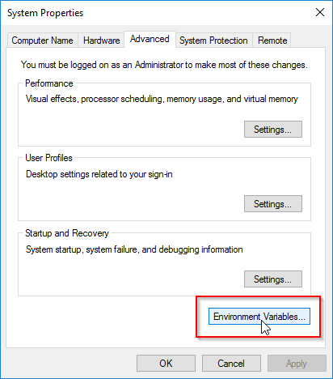

Өөрсдийн ашиглаж сурсан IDE байвал тэрийгээ ашиглах, байхгүй бол доорхи програмыг суулгаж, тохируулаарай
#Visual studio code дээр c++ програм бичих, compile хийх орчин бэлдэх арга

[Энэ](https://code.visualstudio.com/docs/cpp/config-mingw#_prerequisites) зааврын дагуу хийнэ.

1. Visual studio code(VSCode) суулгах
  * [Visual Studio Code](https://code.visualstudio.com/download)
2. VSCode дээр "C/C++ extension for VS Code" суулгах
  * Ctrl+Shift+X дараад гарч ирсэн цонхноос "C/C++ extension for VS Code" гэж хайгаад гарч ирсэнийг нь сонгоод "Install" дарахад суугдана. 
3. MinGW-w64 toolchain суулгана.
  * [MinGW-w64](https://github.com/msys2/msys2-installer/releases/download/2023-07-18/msys2-x86_64-20230718.exe)-ийг татаж аваад суулгана.
  * суулгахад гарч ирэх цонхнуудын утгыг нь өөрчлөлгүй next,install товчуудыг дарна.
  * Суулгаж дуусгахад terminal нээгдэнэ. Тэр terminal дээр доорхи кодыг хуулж ажиллуулна.<br>```pacman -S --needed base-devel mingw-w64-x86_64-toolchain```
  * асуулт гарч ирэхэд нь Enter дарна.(2 удаа) 
4. Үйлдлийн системийн path-руу MinGW-w64-ийн bin folder-ийн байршлыг нэмнэ
  * start menu-ээ дараад "advanced system settings" гэж оруулахад гарч ирснийг нь сонгоно.
  * Environment Variables-ийг сонгоно.
  * System variables дотор байгаа "Path"-ийг сонгоод Edit дарна
  * New-ийг дараад доорхи мөрийг код хийнэ.<br>```C:\msys64\mingw64\bin```
  * OK гэснийг дараад хаана.
  * онгорхой terminal байвал бүгдийг нь хаана.
  * start menu дээр cmd гэж хайгаад, ажиллуулна
  * доорхи командуудыг ажиллуулж шалгана.Version гэсэн мэдээлэл гарч байвал ОК гэсэн үг.<br>```gcc --verion```<br>```g++ --version```<br>```gdb --version```

##C++ код бичих
* start menu дээр cmd гэж хайгаад, command prompt ажиллуулна
* доорхи кодыг мөр мөрөөр ажиллуулна.
  ```cpp
  mkdir project
  cd project
  code .
  ```
* Шинэ файл үүсгэнэ.
* "helloworld.cpp" гэж нэр өгөөд, доорхи кодыг дотор нь хуулна.
```cpp
#include <iostream>
#include <vector>
#include <string>

using namespace std;

int main()
{
    vector<string> msg {"Hello", "C++", "World", "from", "VS Code", "and the C++ extension!"};

    for (const string& word : msg)
    {
        cout << word << " ";
    }
    cout << endl;
}
```
* доорхи зургын дагуу play товчыг дараад, гарч ирсэн сонголтоос g++ гэснийг нь сонгоно.
* Terminal tab дээр доорхи зурагтай адил харагдаж байвал бүх юм ОК гэсэн үг.
